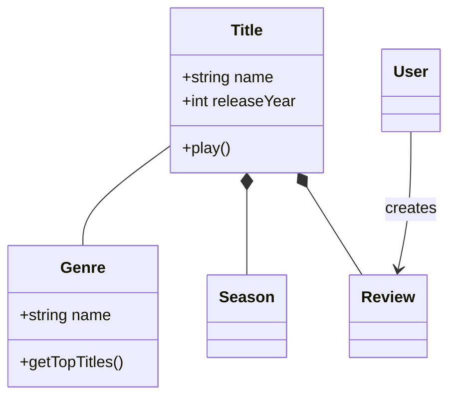
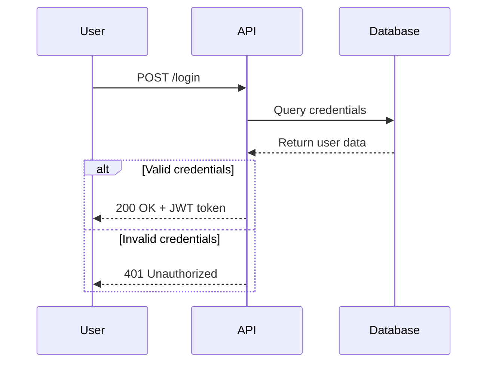
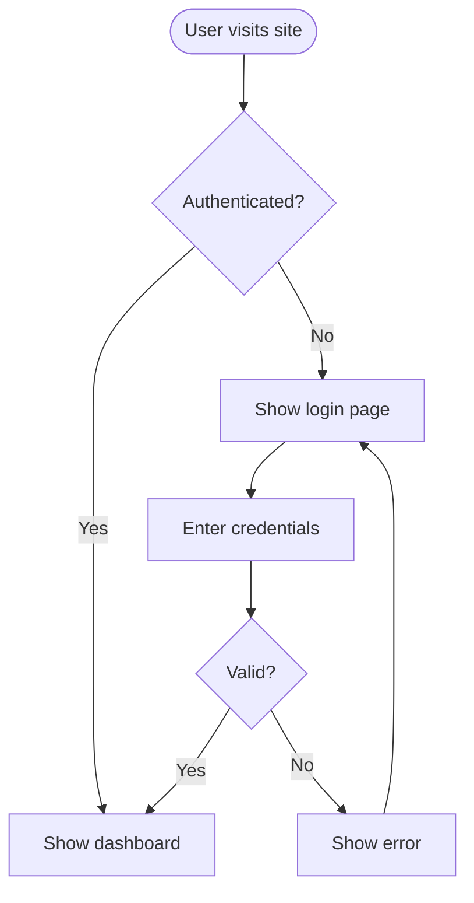
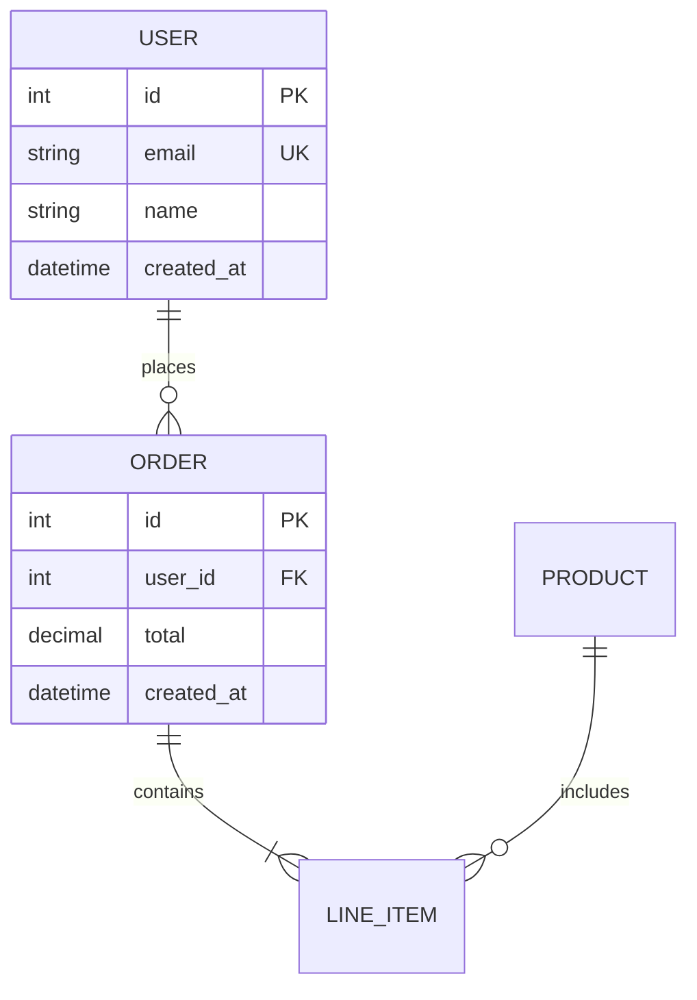
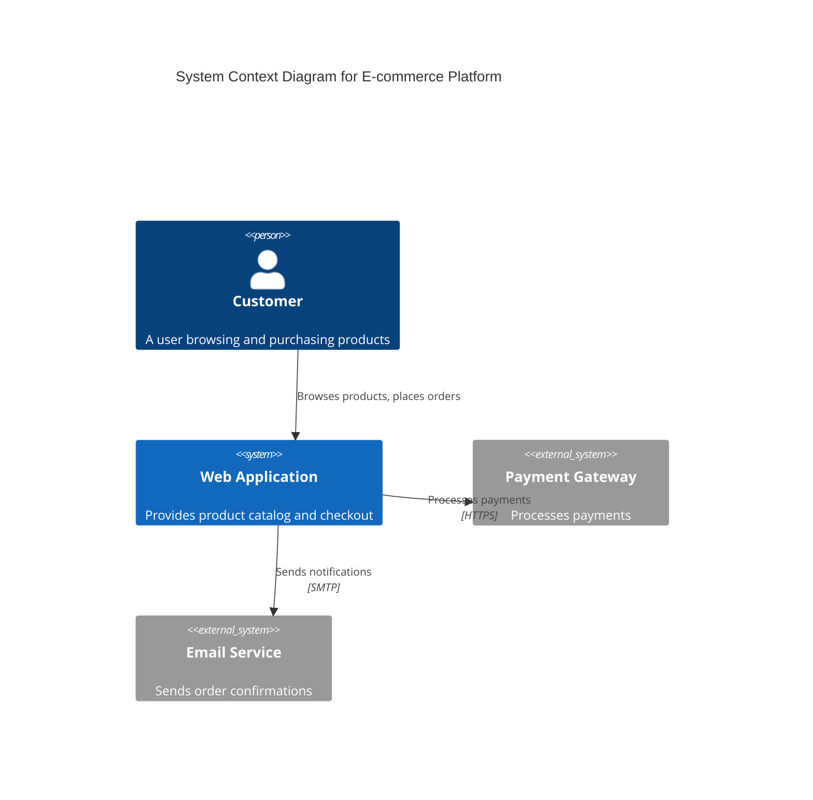

# Mermaid Diagrams Skill

[中文文档](README_CN.md) | [English Documentation](README.md)

A comprehensive guide for creating professional software diagrams using Mermaid's text-based syntax. This skill enables you to visualize system architecture, document code structure, model databases, and communicate technical concepts through diagrams.

## Purpose

Transform complex technical concepts into clear, maintainable diagrams that can be version-controlled alongside your code. Mermaid diagrams are rendered from simple text definitions, making them easy to update, review in pull requests, and maintain over time.

## When to Use This Skill

Use this skill when you need to:

- **Document architecture** - Visualize system context, containers, components, and deployment
- **Model domains** - Create domain models with entities, relationships, and behaviors
- **Explain flows** - Show API interactions, user journeys, authentication sequences
- **Design databases** - Document table relationships, keys, and schema structure
- **Plan processes** - Map workflows, decision trees, algorithms, and pipelines
- **Communicate designs** - Align stakeholders on technical decisions before coding

### Trigger Phrases

The skill activates when you mention:
- "diagram", "visualize", "model", "map out", "show the flow", "chart", "graph"
- "architecture diagram", "class diagram", "sequence diagram", "flowchart"
- "database schema", "ERD", "entity relationship"
- "system design", "data model", "domain model"
- "mindmap", "timeline", "gantt", "kanban"
- "state machine", "git graph", "branching strategy"
- "pie chart", "bar chart", "radar chart", "quadrant chart"
- "sankey", "treemap", "venn diagram", "fishbone"
- "packet diagram", "network protocol", "requirement traceability"
- "event modeling", "wardley map", "tree view"

## How It Works

1. **Choose the right diagram type** based on what you want to communicate
2. **Start with core elements** - entities, actors, or components
3. **Add relationships** - connections, flows, interactions
4. **Refine incrementally** - add details, styling, notes
5. **Export or embed** - use in documentation, PRs, wikis

## Key Features

### 28 Diagram Types Supported

1. **Class Diagrams** - Domain models, OOP design, entity relationships
2. **Sequence Diagrams** - API flows, user interactions, temporal sequences
3. **Flowcharts** - User journeys, processes, decision logic, pipelines
4. **Entity Relationship Diagrams** - Database schemas, table relationships
5. **C4 Architecture Diagrams** - System context, containers, components
6. **State Diagrams** - State machines, lifecycle states
7. **Git Graphs** - Branching strategies, version control flows
8. **Gantt Charts** - Project timelines, scheduling
9. **Pie Charts** - Simple data proportions
10. **Quadrant Charts** - Two-dimensional data plotting
11. **XY Charts** - Bar and line charts with axes
12. **Radar Charts** - Multi-dimensional comparison
13. **Sankey Diagrams** - Flow visualization
14. **Mindmaps** - Information hierarchy and brainstorming
15. **Timelines** - Chronological events
16. **Kanban Boards** - Task workflow visualization
17. **Block Diagrams** - System component visualization
18. **Packet Diagrams** - Network packet structures
19. **Requirement Diagrams** - Requirements traceability (SysML)
20. **Treemaps** - Hierarchical data proportions
21. **Venn Diagrams** - Set relationships
22. **Ishikawa Diagrams** - Cause-and-effect analysis
23. **Wardley Maps** - Strategy and evolution
24. **TreeViews** - Directory and hierarchy display
25. **Event Modeling** - Event-driven system design
26. **ZenUML** - Alternative sequence diagram syntax
27. **Architecture Diagrams** - Cloud and infrastructure
28. **User Journey Diagrams** - User experience flows

### Advanced Capabilities

- **Themes and styling** - Default, forest, dark, neutral, base themes
- **Custom theming** - Configure colors, fonts, and layout
- **Layout options** - Dagre (balanced) or ELK (advanced)
- **Look options** - Classic or hand-drawn sketch style
- **Subgraphs** - Group related elements for clarity
- **Notes and comments** - Add context and explanations
- **Alt/loop/opt blocks** - Complex flow control in sequences

### Integration Support

- **GitHub/GitLab** - Automatic rendering in Markdown files
- **VS Code** - Preview with Markdown Mermaid extension
- **Notion, Obsidian, Confluence** - Built-in support
- **Export** - PNG, SVG, PDF via Mermaid Live or CLI

## Usage Examples

### Example 1: Document a Domain Model

**When:** You're designing a video streaming platform and need to model core entities.

### Example 2: Explain an API Authentication Flow

**When:** You need to document how login works for frontend developers.

### Example 3: Map a User Journey

**When:** You're planning a feature and need to visualize the user flow.

### Example 4: Design a Database Schema

**When:** You're planning table relationships for a new feature.

### Example 5: Visualize System Architecture (C4)

**When:** You need to show how systems and external services interact.

## Getting Started

1. **Identify what you need to communicate** - Architecture? Flow? Data model?
2. **Choose the appropriate diagram type** - See "Diagram Type Selection Guide" in SKILL.md
3. **Start simple** - Add core entities/components first
4. **Add relationships** - Connect elements with appropriate connectors
5. **Refine and style** - Add details, notes, and custom theming
6. **Validate** - Test in [Mermaid Live Editor](https://mermaid.live)
7. **Embed or export** - Use in Markdown, export as image, or integrate

## Detailed References

For comprehensive syntax and advanced features, see:

- **[SKILL.md](SKILL.md)** - Quick start guide and diagram selection
- **[references/class-diagrams.md](references/class-diagrams.md)** - Relationships, multiplicity, methods
- **[references/sequence-diagrams.md](references/sequence-diagrams.md)** - Messages, activations, loops, alt blocks
- **[references/flowcharts.md](references/flowcharts.md)** - Node shapes, decision logic, subgraphs
- **[references/erd-diagrams.md](references/erd-diagrams.md)** - Cardinality, keys, attributes
- **[references/c4-diagrams.md](references/c4-diagrams.md)** - Context, container, component levels
- **[references/architecture-diagrams.md](references/architecture-diagrams.md)** - Cloud services, infrastructure, CI/CD deployments
- **[references/state-diagrams.md](references/state-diagrams.md)** - States, transitions, composite states
- **[references/gantt-charts.md](references/gantt-charts.md)** - Tasks, milestones, dependencies
- **[references/git-graphs.md](references/git-graphs.md)** - Branches, commits, merges, tags
- **[references/mindmaps.md](references/mindmaps.md)** - Hierarchical nodes, node shapes
- **[references/timelines.md](references/timelines.md)** - Events, dates, sections
- **[references/kanban-diagrams.md](references/kanban-diagrams.md)** - Columns, tasks, metadata
- **[references/xy-charts.md](references/xy-charts.md)** - Bar charts, line charts, axes
- **[references/radar-charts.md](references/radar-charts.md)** - Axes, curves, data comparison
- **[references/sankey-diagrams.md](references/sankey-diagrams.md)** - Nodes, flows, values
- **[references/pie-charts.md](references/pie-charts.md)** - Data slices, labels, percentages
- **[references/quadrant-charts.md](references/quadrant-charts.md)** - Axes, data points, quadrant labels
- **[references/block-diagrams.md](references/block-diagrams.md)** - Blocks, connections, layouts
- **[references/packet-diagrams.md](references/packet-diagrams.md)** - Bit fields, headers, data
- **[references/requirement-diagrams.md](references/requirement-diagrams.md)** - Requirements, elements, relationships
- **[references/treemaps.md](references/treemaps.md)** - Hierarchical rectangles, values
- **[references/venn-diagrams.md](references/venn-diagrams.md)** - Sets, unions, intersections
- **[references/ishikawa-diagrams.md](references/ishikawa-diagrams.md)** - Causes, effects, categories
- **[references/wardley-maps.md](references/wardley-maps.md)** - Value chains, evolution, components
- **[references/treeviews.md](references/treeviews.md)** - Directory structures, hierarchies
- **[references/event-modeling.md](references/event-modeling.md)** - Events, commands, swimlanes
- **[references/zenuml-diagrams.md](references/zenuml-diagrams.md)** - Alternative sequence syntax
- **[references/user-journeys.md](references/user-journeys.md)** - Tasks, sections, scoring
- **[references/advanced-features.md](references/advanced-features.md)** - Themes, styling, configuration

## Best Practices

1. **Start simple, iterate** - Begin with core elements, add complexity gradually
2. **One diagram, one concept** - Keep diagrams focused and split large views
3. **Use meaningful names** - Clear labels make diagrams self-documenting
4. **Comment liberally** - Use `%%` to explain non-obvious relationships
5. **Version control** - Store `.mmd` files with code, update as system evolves
6. **Add context** - Include titles and notes explaining diagram purpose
7. **Validate syntax** - Test in Mermaid Live before committing
8. **Keep it readable** - Don't overcrowd; split into multiple diagrams if needed

## Common Use Cases

- **Onboarding** - Help new team members understand system structure
- **Design reviews** - Visualize proposals before implementation
- **Documentation** - Create living docs that evolve with code
- **Architecture decisions** - Align stakeholders on technical choices
- **Refactoring** - Plan restructuring with before/after diagrams
- **API handoffs** - Document flows for frontend/backend coordination
- **Database migrations** - Visualize schema changes

## Tips for Success

- **Test incrementally** - Validate syntax as you build to catch errors early
- **Use consistent naming** - Match diagram names to code/database names
- **Leverage GitHub rendering** - Diagrams appear automatically in `.md` files
- **Export for presentations** - Use Mermaid Live or CLI for high-res exports
- **Collaborate** - Diagrams are great for PR discussions and design docs
- **Keep updated** - Update diagrams when code changes to prevent drift

## Tools and Resources

- **[Mermaid Live Editor](https://mermaid.live)** - Interactive editor with instant preview and export
- **[Official Documentation](https://mermaid.js.org)** - Comprehensive syntax reference
- **Installation** - Install the skill locally: `npx skills install mermaid-diagrams`
- **Mermaid CLI** - `npm install -g @mermaid-js/mermaid-cli` for batch exports
- **VS Code Extension** - "Markdown Preview Mermaid Support" for live preview
- **GitHub** - Native rendering in all `.md` files

## Support

For questions, syntax help, or advanced features, refer to:
- SKILL.md for quick reference
- Reference files in `references/` for detailed syntax
- [Mermaid official docs](https://mermaid.js.org) for latest features
