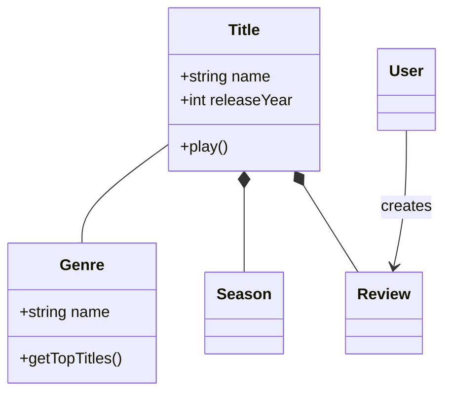
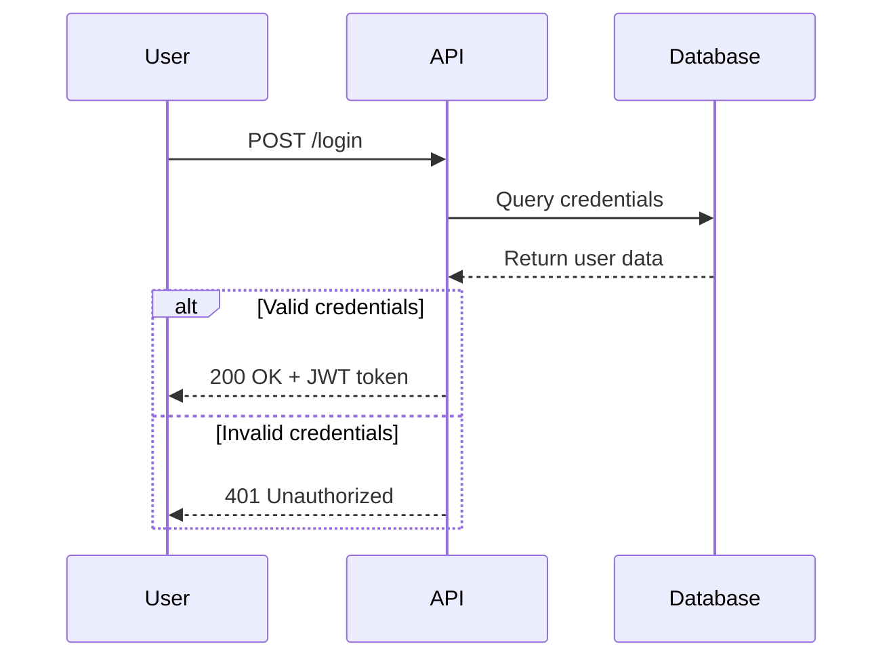
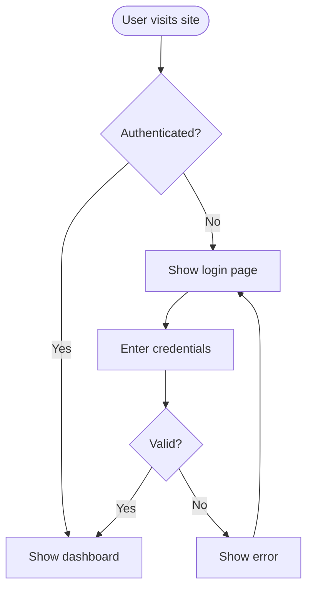
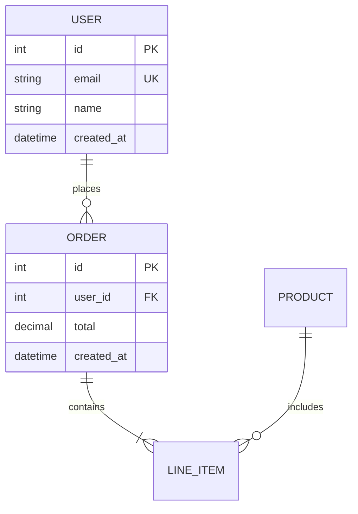
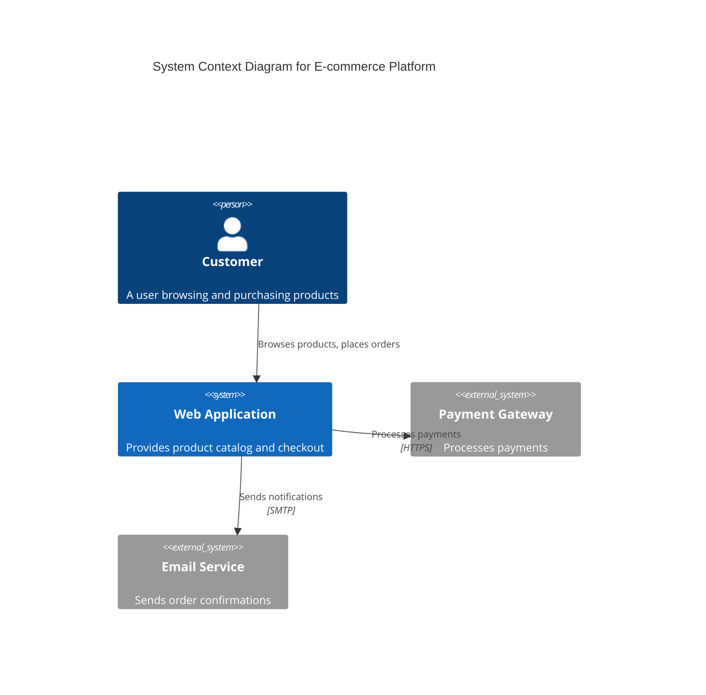

# Mermaid 图表技能

[中文文档](README_CN.md) | [English Documentation](README.md)

一份使用 Mermaid 文本语法创建专业软件图表的综合指南。这项技能使你能够通过图表可视化系统架构、记录代码结构、建模数据库，并传达技术概念。

## 目的

将复杂的技术概念转化为清晰、可维护的图表，这些图表可以与代码一起进行版本控制。Mermaid 图表由简单的文本定义渲染而成，使其易于更新、在拉取请求中审查，并随时间维护。

## 何时使用此技能

当你需要时使用此技能：

- **记录架构** - 可视化系统上下文、容器、组件和部署
- **建模领域** - 创建包含实体、关系和行为的领域模型
- **解释流程** - 展示 API 交互、用户旅程、认证序列
- **设计数据库** - 记录表关系、键和模式结构
- **规划流程** - 映射工作流、决策树、算法和管道
- **传达设计** - 在编码前与利益相关者就技术决策达成一致

### 触发短语

当提到以下内容时，技能会激活：
- "diagram"（图表）、"visualize"（可视化）、"model"（建模）、"map out"（绘制）、"show the flow"（展示流程）、"chart"（图表）、"graph"（图形）
- "architecture diagram"（架构图）、"class diagram"（类图）、"sequence diagram"（序列图）、"flowchart"（流程图）
- "database schema"（数据库模式）、"ERD"（实体关系图）、"entity relationship"（实体关系）
- "system design"（系统设计）、"data model"（数据模型）、"domain model"（领域模型）
- "mindmap"（思维导图）、"timeline"（时间线）、"gantt"（甘特图）、"kanban"（看板）
- "state machine"（状态机）、"git graph"（Git 图）、"branching strategy"（分支策略）
- "pie chart"（饼图）、"bar chart"（条形图）、"radar chart"（雷达图）、"quadrant chart"（象限图）
- "sankey"（桑基图）、"treemap"（树图）、"venn diagram"（维恩图）、"fishbone"（鱼骨图）
- "packet diagram"（数据包图）、"network protocol"（网络协议）、"requirement traceability"（需求追溯）
- "event modeling"（事件建模）、"wardley map"（沃德利地图）、"tree view"（树视图）

## 工作原理

1. **选择合适的图表类型** - 根据你想传达的内容选择
2. **从核心元素开始** - 实体、参与者或组件
3. **添加关系** - 连接、流、交互
4. **逐步完善** - 添加细节、样式、注释
5. **导出或嵌入** - 在文档、PR、Wiki 中使用

## 安装

```bash
npx skills add https://github.com/TrueHOOHA/beautiful-mermaid-skill.git --skill mermaid-diagrams
```

## 主要特性

### 支持 28 种图表类型

1. **类图** - 领域模型、OOP 设计、实体关系
2. **序列图** - API 流程、用户交互、时间序列
3. **流程图** - 用户旅程、流程、决策逻辑、管道
4. **实体关系图** - 数据库模式、表关系
5. **C4 架构图** - 系统上下文、容器、组件
6. **状态图** - 状态机、生命周期状态
7. **Git 图** - 分支策略、版本控制流程
8. **甘特图** - 项目时间线、调度
9. **饼图** - 简单数据比例
10. **象限图** - 二维数据绘图
11. **XY 图表** - 带轴的条形图和折线图
12. **雷达图** - 多维度比较
13. **桑基图** - 流可视化
14. **思维导图** - 信息层次和头脑风暴
15. **时间线** - 按时间顺序排列的事件
16. **看板** - 任务工作流可视化
17. **框图** - 系统组件可视化
18. **数据包图** - 网络数据包结构
19. **需求图** - 需求追溯性 (SysML)
20. **树图** - 层次数据比例
21. **维恩图** - 集合关系
22. **石川图** - 因果分析
23. **沃德利地图** - 战略和演进
24. **树视图** - 目录和层次显示
25. **事件建模** - 事件驱动系统设计
26. **ZenUML** - 替代序列图语法
27. **架构图** - 云和基础设施
28. **用户旅程图** - 用户体验流程

### 高级功能

- **主题和样式** - 默认、森林、深色、中性、基础主题
- **自定义主题** - 配置颜色、字体和布局
- **布局选项** - Dagre（平衡）或 ELK（高级）
- **外观选项** - 经典或手绘草图风格
- **子图** - 将相关元素分组以提高清晰度
- **注释和评论** - 添加上下文和解释
- **alt/loop/opt 块** - 序列中的复杂流控制

### 集成支持

- **GitHub/GitLab** - Markdown 文件中自动渲染
- **VS Code** - 使用 Markdown Mermaid 扩展预览
- **Notion、Obsidian、Confluence** - 内置支持
- **导出** - 通过 Mermaid Live 或 CLI 导出 PNG、SVG、PDF

## 使用示例

### 示例 1：记录领域模型

**何时：** 你正在设计一个视频流平台，需要对核心实体进行建模。



### 示例 2：解释 API 认证流程

**何时：** 你需要为前端开发人员记录登录的工作原理。



### 示例 3：映射用户旅程

**何时：** 你正在规划一个功能，需要可视化用户流程。



### 示例 4：设计数据库模式

**何时：** 你正在为新功能规划表关系。



### 示例 5：可视化系统架构 (C4)

**何时：** 你需要展示系统和外部服务如何交互。



## 入门指南

1. **确定你需要传达什么** - 架构？流程？数据模型？
2. **选择合适的图表类型** - 参见 SKILL.md 中的"图表类型选择指南"
3. **从简单开始** - 首先添加核心实体/组件
4. **添加关系** - 使用适当的连接器连接元素
5. **完善和样式化** - 添加细节、注释和自定义主题
6. **验证** - 在 [Mermaid Live Editor](https://mermaid.live) 中测试
7. **嵌入或导出** - 在 Markdown 中使用、导出为图像或集成

## 详细参考

有关全面的语法和高级功能，请参阅：

- **[SKILL.md](SKILL.md)** - 快速入门指南和图表选择
- **[references/class-diagrams.md](references/class-diagrams.md)** - 关系、多重性、方法
- **[references/sequence-diagrams.md](references/sequence-diagrams.md)** - 消息、激活、循环、alt 块
- **[references/flowcharts.md](references/flowcharts.md)** - 节点形状、决策逻辑、子图
- **[references/erd-diagrams.md](references/erd-diagrams.md)** - 基数、键、属性
- **[references/c4-diagrams.md](references/c4-diagrams.md)** - 上下文、容器、组件级别
- **[references/architecture-diagrams.md](references/architecture-diagrams.md)** - 云服务、基础设施、CI/CD 部署
- **[references/state-diagrams.md](references/state-diagrams.md)** - 状态、转换、复合状态
- **[references/gantt-charts.md](references/gantt-charts.md)** - 任务、里程碑、依赖关系
- **[references/git-graphs.md](references/git-graphs.md)** - 分支、提交、合并、标签
- **[references/mindmaps.md](references/mindmaps.md)** - 层次节点、节点形状
- **[references/timelines.md](references/timelines.md)** - 事件、日期、部分
- **[references/kanban-diagrams.md](references/kanban-diagrams.md)** - 列、任务、元数据
- **[references/xy-charts.md](references/xy-charts.md)** - 条形图、折线图、轴
- **[references/radar-charts.md](references/radar-charts.md)** - 轴、曲线、数据比较
- **[references/sankey-diagrams.md](references/sankey-diagrams.md)** - 节点、流、值
- **[references/pie-charts.md](references/pie-charts.md)** - 数据切片、标签、百分比
- **[references/quadrant-charts.md](references/quadrant-charts.md)** - 轴、数据点、象限标签
- **[references/block-diagrams.md](references/block-diagrams.md)** - 块、连接、布局
- **[references/packet-diagrams.md](references/packet-diagrams.md)** - 位域、头部、数据
- **[references/requirement-diagrams.md](references/requirement-diagrams.md)** - 需求、元素、关系
- **[references/treemaps.md](references/treemaps.md)** - 层次矩形、值
- **[references/venn-diagrams.md](references/venn-diagrams.md)** - 集合、并集、交集
- **[references/ishikawa-diagrams.md](references/ishikawa-diagrams.md)** - 原因、效果、类别
- **[references/wardley-maps.md](references/wardley-maps.md)** - 价值链、演进、组件
- **[references/treeviews.md](references/treeviews.md)** - 目录结构、层次
- **[references/event-modeling.md](references/event-modeling.md)** - 事件、命令、泳道
- **[references/zenuml-diagrams.md](references/zenuml-diagrams.md)** - 替代序列语法
- **[references/user-journeys.md](references/user-journeys.md)** - 任务、部分、评分
- **[references/advanced-features.md](references/advanced-features.md)** - 主题、样式、配置

## 最佳实践

1. **从简单开始，迭代** - 从核心元素开始，逐渐增加复杂性
2. **一个图表，一个概念** - 保持图表专注，拆分大型视图
3. **使用有意义的名称** - 清晰的标签使图表自我文档化
4. **自由注释** - 使用 `%%` 解释不明显的关系
5. **版本控制** - 将 `.mmd` 文件与代码一起存储，随系统演变而更新
6. **添加上下文** - 包括标题和注释，解释图表目的
7. **验证语法** - 在提交前在 Mermaid Live 中测试
8. **保持可读性** - 不要过度拥挤；如有需要拆分为多个图表

## 常见用例

- **入职培训** - 帮助新团队成员理解系统结构
- **设计评审** - 在实施前可视化提案
- **文档** - 创建随代码演变的活文档
- **架构决策** - 就技术选择与利益相关者保持一致
- **重构** - 使用前后图表计划重组
- **API 交接** - 记录流程以协调前端/后端
- **数据库迁移** - 可视化模式变更

## 成功技巧

- **增量测试** - 构建时验证语法以尽早发现错误
- **使用一致的命名** - 图表名称与代码/数据库名称匹配
- **利用 GitHub 渲染** - 图表自动出现在 `.md` 文件中
- **导出用于演示** - 使用 Mermaid Live 或 CLI 获取高分辨率导出
- **协作** - 图表非常适合 PR 讨论和设计文档
- **保持更新** - 代码变更时更新图表以防止漂移

## 工具和资源

- **[Mermaid Live Editor](https://mermaid.live)** - 具有即时预览和导出功能的交互式编辑器
- **[官方文档](https://mermaid.js.org)** - 全面的语法参考
- **安装** - 本地安装技能：`npx skills install mermaid-diagrams`
- **Mermaid CLI** - `npm install -g @mermaid-js/mermaid-cli` 用于批量导出
- **VS Code 扩展** - "Markdown Preview Mermaid Support" 用于实时预览
- **GitHub** - 所有 `.md` 文件中的原生渲染

## 支持

有关问题、语法帮助或高级功能，请参阅：
- SKILL.md 供快速参考
- `references/` 中的参考文件供详细语法
- [Mermaid 官方文档](https://mermaid.js.org) 获取最新功能
