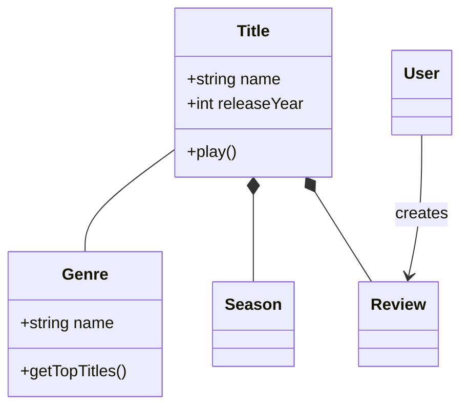
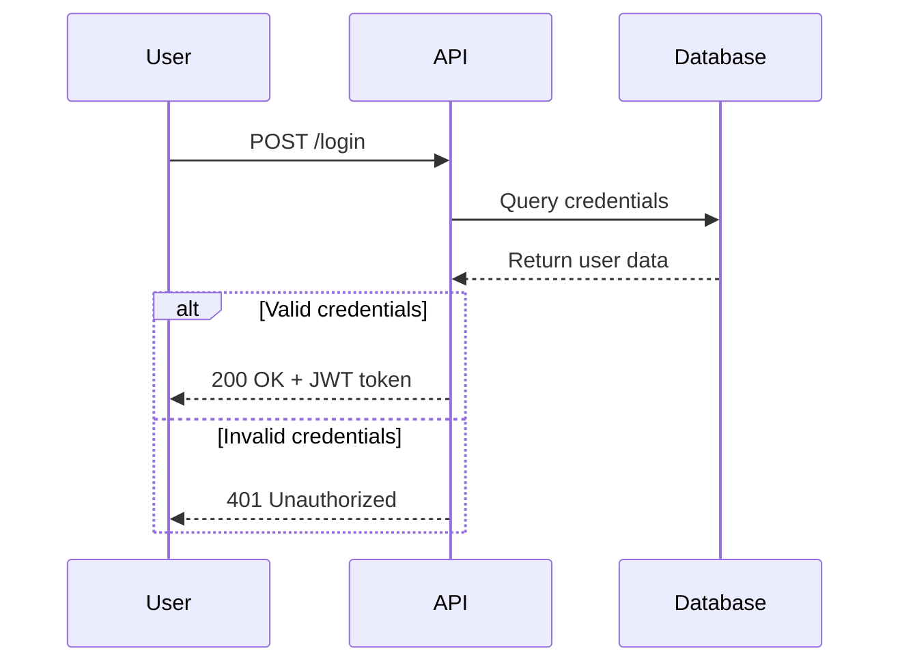
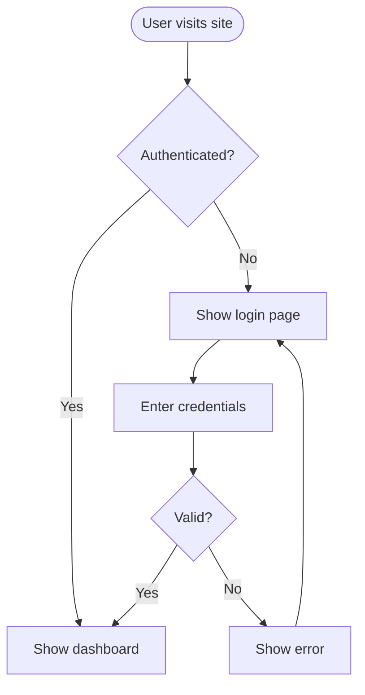
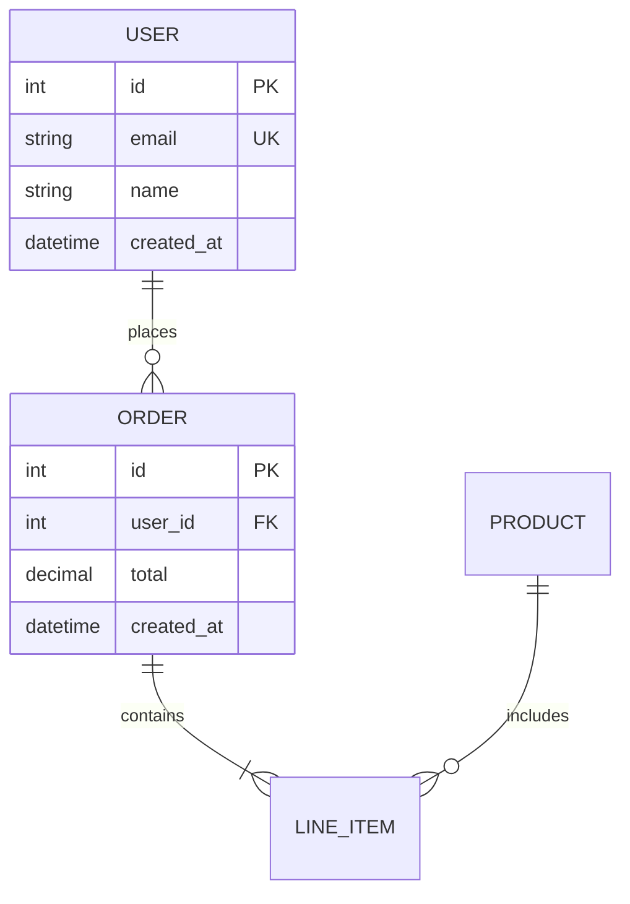
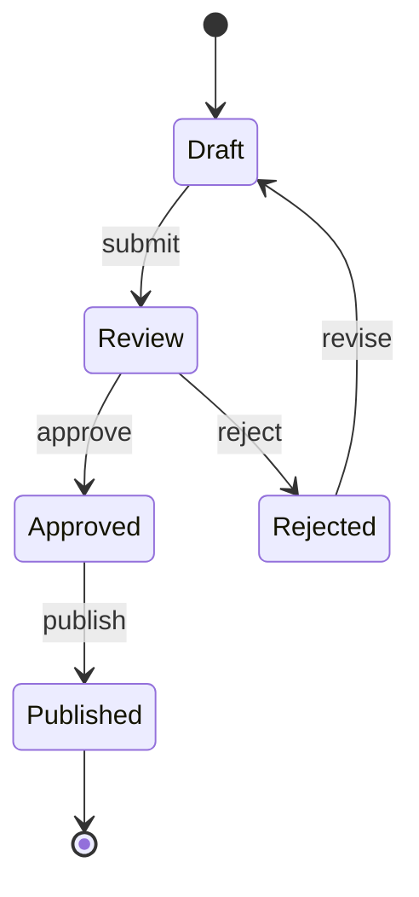
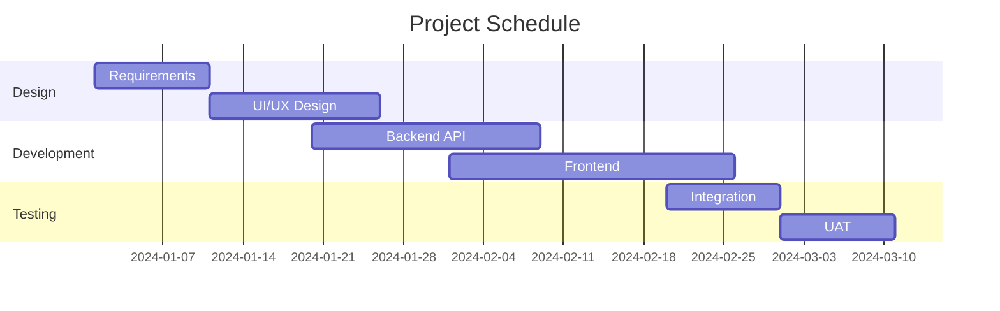
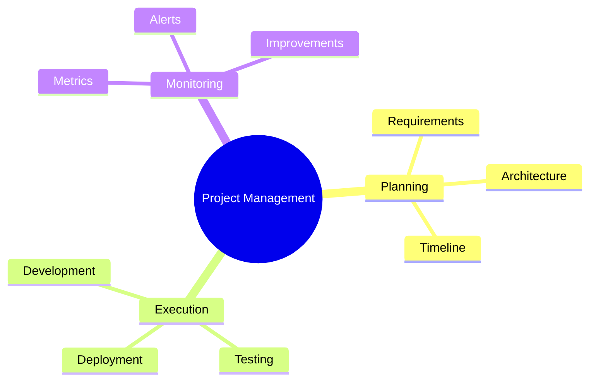
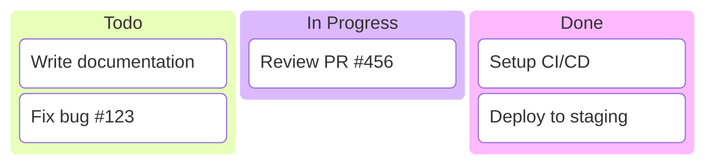
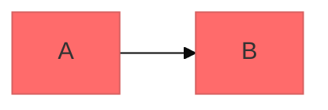

# Mermaid Diagramming

Create professional software diagrams using Mermaid's text-based syntax. Mermaid renders diagrams from simple text definitions, making diagrams version-controllable, easy to update, and maintainable alongside code.

## Core Syntax Structure

All Mermaid diagrams follow this pattern:

```mermaid
diagramType
  definition content
```

**Key principles:**
- First line declares diagram type (e.g., `classDiagram`, `sequenceDiagram`, `flowchart`)
- Use `%%` for comments
- Line breaks and indentation improve readability but aren't required
- Unknown words break diagrams; parameters fail silently

## Diagram Type Selection Guide

**Choose the right diagram type:**

1. **Flowcharts** - Processes, algorithms, decision trees, user journeys
   - Business processes and workflows
   - Algorithm logic and control flow
   - Deployment pipelines
   - Decision trees

2. **Sequence Diagrams** - Temporal interactions, message flows
   - API request/response flows
   - User authentication flows
   - System component interactions
   - Method call sequences

3. **Class Diagrams** - Domain modeling, OOP design, entity relationships
   - Domain-driven design documentation
   - Object-oriented class structures
   - Entity relationships and dependencies

4. **Entity Relationship Diagrams (ERD)** - Database schemas
   - Table relationships
   - Data modeling
   - Schema design

5. **C4 Diagrams** - Software architecture at multiple levels
   - System Context (systems and users)
   - Container (applications, databases, services)
   - Component (internal structure)
   - Code (class/interface level)

6. **State Diagrams** - State machines, lifecycle states
   - UI component states
   - Workflow status transitions
   - Object lifecycles

7. **Git Graphs** - Version control branching strategies
   - Feature branching workflows
   - Release management
   - Merge strategies

8. **Gantt Charts** - Project timelines, scheduling
   - Project planning and milestones
   - Resource allocation
   - Dependency tracking

9. **Pie Charts** - Simple data proportions
   - Market share visualization
   - Budget allocation
   - Survey results

10. **Quadrant Charts** - Two-dimensional data plotting
    - Priority matrices
    - Risk/impact assessment
    - Feature prioritization

11. **XY Charts** - Bar and line charts with axes
    - Sales trends over time
    - Performance metrics
    - Comparative data analysis

12. **Radar Charts** - Multi-dimensional comparison
    - Skills assessment
    - Product feature comparison
    - Performance evaluation

13. **Sankey Diagrams** - Flow visualization
    - Energy/material flows
    - Budget flows
    - User journey funnels

14. **Mindmaps** - Information hierarchy and brainstorming
    - Concept mapping
    - Idea organization
    - Knowledge structures

15. **Timelines** - Chronological events
    - Project history
    - Product roadmaps
    - Historical events

16. **Kanban Boards** - Task workflow visualization
    - Sprint planning
    - Bug tracking workflows
    - Status tracking

17. **Block Diagrams** - System component visualization
    - Hardware systems
    - Software modules
    - Control systems

18. **Packet Diagrams** - Network packet structures
    - Protocol documentation
    - Network packet analysis
    - Binary data layouts

19. **Requirement Diagrams** - Requirements traceability
    - System requirements
    - Compliance tracking
    - Verification methods

20. **Treemaps** - Hierarchical data proportions
    - Disk usage
    - Budget breakdowns
    - Portfolio allocation

21. **Venn Diagrams** - Set relationships
    - Feature overlap analysis
    - Audience segmentation
    - Capability comparison

22. **Ishikawa (Fishbone) Diagrams** - Cause-and-effect analysis
    - Root cause analysis
    - Quality improvement
    - Problem diagnosis

23. **Wardley Maps** - Strategy and evolution
    - Business strategy
    - Value chain mapping
    - Component evolution

24. **TreeViews** - Directory and hierarchy display
    - Folder structures
    - Org charts
    - File system navigation

25. **Event Modeling** - Event-driven system design
    - Event-sourced systems
    - Domain event flows
    - System state transitions

26. **ZenUML** - Alternative sequence diagram syntax
    - Code-like sequence descriptions
    - Lightweight interaction diagrams

27. **Architecture Diagrams** - Cloud and infrastructure
    - Cloud service relationships
    - CI/CD pipelines
    - System topology

28. **User Journey Diagrams** - User experience flows
    - Task completion analysis
    - Satisfaction scoring
    - UX touchpoints

## Quick Start Examples

### Class Diagram (Domain Model)


### Sequence Diagram (API Flow)


### Flowchart (User Journey)


### ERD (Database Schema)


### State Diagram (Lifecycle)


### Gantt Chart (Project Timeline)


### Mindmap (Information Hierarchy)


### Kanban Board (Workflow)


## Detailed References

For in-depth guidance on specific diagram types, see:

- **[references/class-diagrams.md](references/class-diagrams.md)** - Domain modeling, relationships (association, composition, aggregation, inheritance), multiplicity, methods/properties
- **[references/sequence-diagrams.md](references/sequence-diagrams.md)** - Actors, participants, messages (sync/async), activations, loops, alt/opt/par blocks, notes
- **[references/flowcharts.md](references/flowcharts.md)** - Node shapes, connections, decision logic, subgraphs, styling
- **[references/erd-diagrams.md](references/erd-diagrams.md)** - Entities, relationships, cardinality, keys, attributes
- **[references/c4-diagrams.md](references/c4-diagrams.md)** - System context, container, component diagrams, boundaries
- **[references/architecture-diagrams.md](references/architecture-diagrams.md)** - Cloud services, infrastructure, CI/CD deployments
- **[references/state-diagrams.md](references/state-diagrams.md)** - States, transitions, composite states, forks/joins
- **[references/gantt-charts.md](references/gantt-charts.md)** - Tasks, milestones, dependencies, sections
- **[references/mindmaps.md](references/mindmaps.md)** - Hierarchical nodes, different node shapes
- **[references/git-graphs.md](references/git-graphs.md)** - Branches, commits, merges, tags
- **[references/pie-charts.md](references/pie-charts.md)** - Data slices, labels, percentages
- **[references/quadrant-charts.md](references/quadrant-charts.md)** - Axes, data points, quadrant labels
- **[references/xy-charts.md](references/xy-charts.md)** - Bar charts, line charts, axes configuration
- **[references/radar-charts.md](references/radar-charts.md)** - Axes, curves, data comparison
- **[references/sankey-diagrams.md](references/sankey-diagrams.md)** - Nodes, flows, values
- **[references/timelines.md](references/timelines.md)** - Events, dates, sections
- **[references/kanban-diagrams.md](references/kanban-diagrams.md)** - Columns, tasks, metadata
- **[references/block-diagrams.md](references/block-diagrams.md)** - Blocks, connections, layouts
- **[references/packet-diagrams.md](references/packet-diagrams.md)** - Bit fields, headers, data
- **[references/requirement-diagrams.md](references/requirement-diagrams.md)** - Requirements, elements, relationships
- **[references/treemaps.md](references/treemaps.md)** - Hierarchical rectangles, values
- **[references/venn-diagrams.md](references/venn-diagrams.md)** - Sets, unions, intersections
- **[references/ishikawa-diagrams.md](references/ishikawa-diagrams.md)** - Causes, effects, categories
- **[references/wardley-maps.md](references/wardley-maps.md)** - Value chains, evolution, components
- **[references/treeviews.md](references/treeviews.md)** - Directory structures, hierarchies
- **[references/event-modeling.md](references/event-modeling.md)** - Events, commands, swimlanes
- **[references/zenuml-diagrams.md](references/zenuml-diagrams.md)** - Alternative sequence syntax
- **[references/user-journeys.md](references/user-journeys.md)** - Tasks, sections, scoring
- **[references/advanced-features.md](references/advanced-features.md)** - Themes, styling, configuration, layout options

## Best Practices

1. **Start Simple** - Begin with core entities/components, add details incrementally
2. **Use Meaningful Names** - Clear labels make diagrams self-documenting
3. **Comment Extensively** - Use `%%` comments to explain complex relationships
4. **Keep Focused** - One diagram per concept; split large diagrams into multiple focused views
5. **Version Control** - Store `.mmd` files alongside code for easy updates
6. **Add Context** - Include titles and notes to explain diagram purpose
7. **Iterate** - Refine diagrams as understanding evolves

## Configuration and Theming

Configure diagrams using frontmatter:



**Available themes:** default, forest, dark, neutral, base

**Layout options:**
- `layout: dagre` (default) - Classic balanced layout
- `layout: elk` - Advanced layout for complex diagrams (requires integration)

**Look options:**
- `look: classic` - Traditional Mermaid style
- `look: handDrawn` - Sketch-like appearance

## Exporting and Rendering

**Native support in:**
- GitHub/GitLab - Automatically renders in Markdown
- VS Code - With Markdown Mermaid extension
- Notion, Obsidian, Confluence - Built-in support

**Export options:**
- [Mermaid Live Editor](https://mermaid.live) - Online editor with PNG/SVG export
- Mermaid CLI - `npm install -g @mermaid-js/mermaid-cli` then `mmdc -i input.mmd -o output.png`
- Docker - `docker run --rm -v $(pwd):/data minlag/mermaid-cli -i /data/input.mmd -o /data/output.png`

## Common Pitfalls

- **Breaking characters** - Avoid `{}` in comments, use proper escape sequences for special characters
- **Syntax errors** - Misspellings break diagrams; validate syntax in Mermaid Live
- **Overcomplexity** - Split complex diagrams into multiple focused views
- **Missing relationships** - Document all important connections between entities

## When to Create Diagrams

**Always diagram when:**
- Starting new projects or features
- Documenting complex systems
- Explaining architecture decisions
- Designing database schemas
- Planning refactoring efforts
- Onboarding new team members

**Use diagrams to:**
- Align stakeholders on technical decisions
- Document domain models collaboratively
- Visualize data flows and system interactions
- Plan before coding
- Create living documentation that evolves with code
