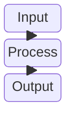

# Block Diagrams

Block diagrams provide an intuitive way to represent complex systems visually using blocks and connectors. Unlike flowcharts, authors have full control over where shapes are positioned.

## Basic Syntax

```mermaid
block
    block "Block A"
        a("This is a block")
    end
    block "Block B"
        b("This is another block")
    end
    a --> b
```

## Block Types

### Simple Blocks



### Composite Blocks

Group blocks together:

```mermaid
block
    block "Frontend"
        f1("React App")
        f2("Static Assets")
    end
    
    block "Backend"
        b1("API Server")
        b2("Worker")
    end
    
    f1 --> b1
    b1 --> b2
```

## Layout Control

### Columns

Organize blocks in columns:


### Rows

Stack blocks vertically:


## Comprehensive Example: System Architecture

```mermaid
block
    columns 3
    block "Client"
        browser("Web Browser")
        mobile("Mobile App")
    end
    
    block "API Layer"
        gateway("API Gateway")
        auth("Auth Service")
    end
    
    block "Data Layer"
        db("Database")
        cache("Cache")
        queue("Message Queue")
    end
    
    browser --> gateway
    mobile --> gateway
    gateway --> auth
    gateway --> db
    auth --> cache
    gateway --> queue
```

## Best Practices

1. **Use descriptive block names** - Clear labels identify components
2. **Group related blocks** - Use composite blocks for subsystems
3. **Control layout** - Use columns to organize complex diagrams
4. **Show connections** - Document how blocks interact
5. **Keep it structured** - Avoid too many crossing lines

## Common Use Cases

- System architecture diagrams
- Hardware component layouts
- Network topology
- Software module organization
- Control systems
