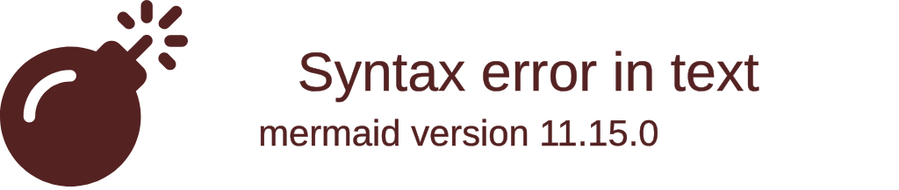
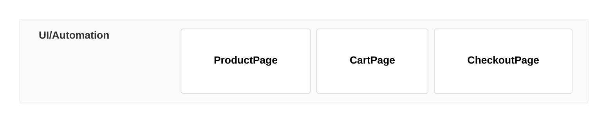
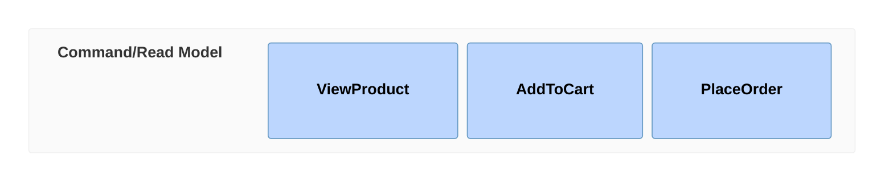
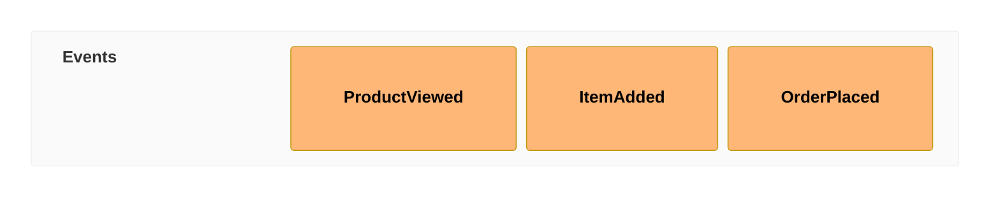

# Event Modeling

Event modeling is a method of describing systems using examples of how information has changed within them over time, organized in swimlanes (UI, Command, Event).

## Basic Syntax

## Swimlanes

### UI (User Interface)

Represents views or screens users interact with:

### Command

Represents actions or commands users trigger:

### Event

Represents state changes or domain events:

## Data

Attach data to events:

## Comprehensive Example

## Best Practices

1. **Follow the timeline** - Events flow left to right through time
2. **Use swimlanes** - Separate UI, commands, and events
3. **Attach data** - Show what information changes
4. **Be specific** - Use realistic example data
5. **Show progression** - Demonstrate the full lifecycle

## Common Use Cases

- Event-sourced system design
- Domain event flows
- CQRS pattern documentation
- System state transitions
- Audit trail visualization
