# Gantt Charts

Gantt charts illustrate project schedules, showing start and finish dates of tasks, milestones, and dependencies between activities.

## Basic Syntax

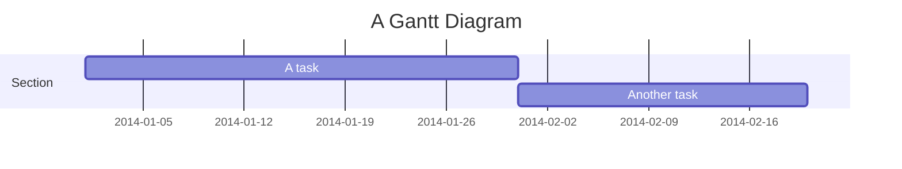

## Date Formats

Common date formats:
- `YYYY-MM-DD` - 2024-01-15
- `DD-MM-YYYY` - 15-01-2024
- `MM-DD-YYYY` - 01-15-2024

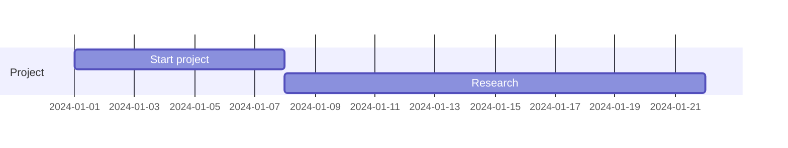

## Tasks and Durations

### Fixed Dates

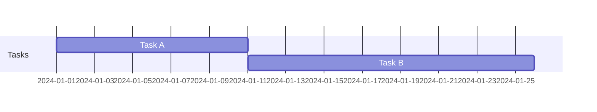

### Relative Dates

Use task IDs to create dependencies:

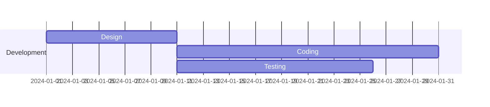

### Milestones

Mark important checkpoints:

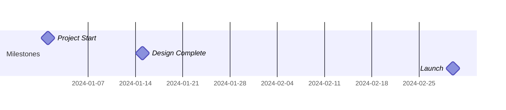

## Sections

Group related tasks:

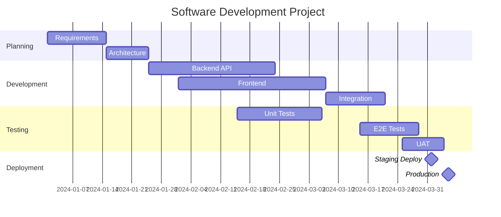

## Task Status

Show task completion status:

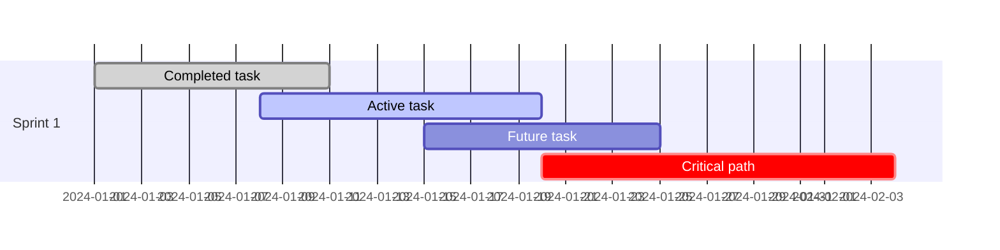

## Dependencies

Link tasks together:

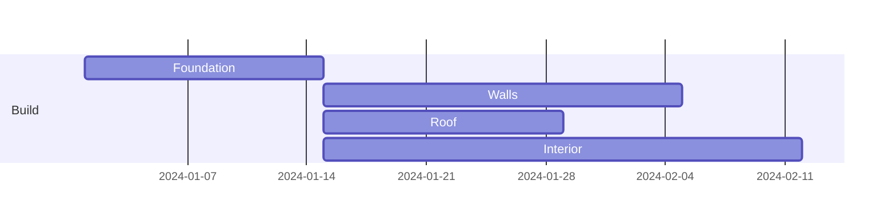

## Comprehensive Example: Product Launch

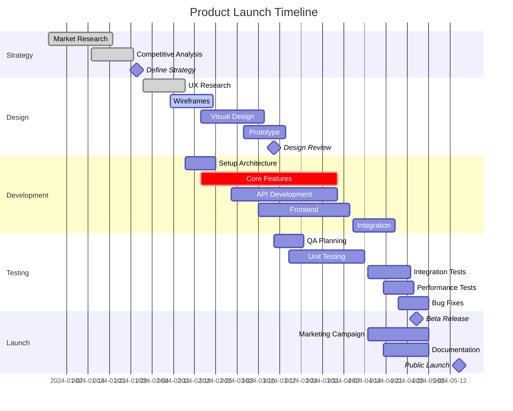

## Best Practices

1. **Use meaningful task names** - Clear descriptions help stakeholders understand
2. **Group by section** - Organize related tasks together
3. **Show dependencies** - Use `after` to link sequential tasks
4. **Mark milestones** - Highlight critical checkpoints with 0-day tasks
5. **Track progress** - Use `:done` and `:active` for status
6. **Identify critical path** - Use `:crit` for tasks that affect overall timeline

## Common Patterns

### Simple Sprint
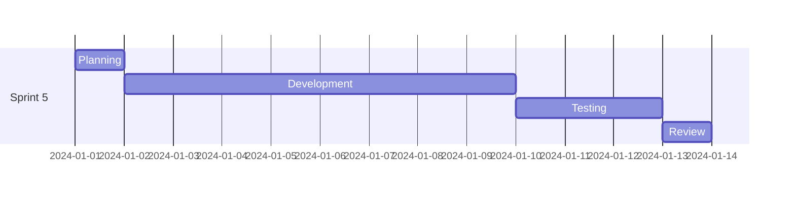

### Parallel Workstreams
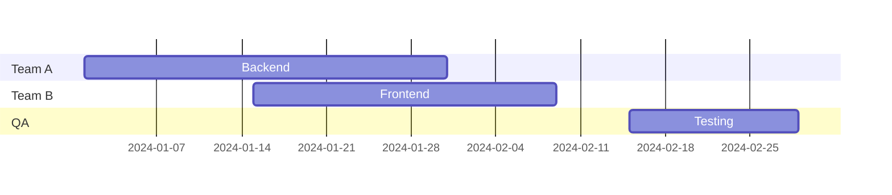
