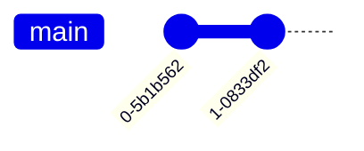
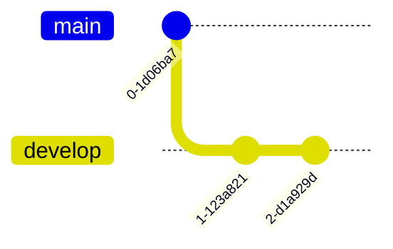
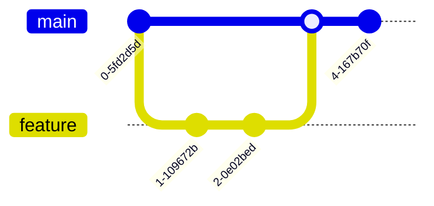
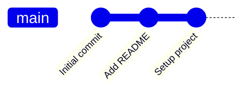
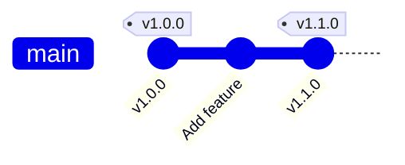
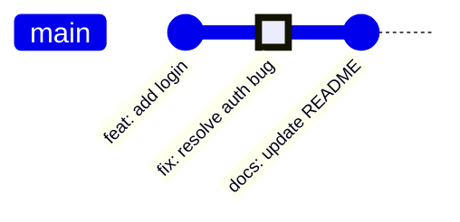
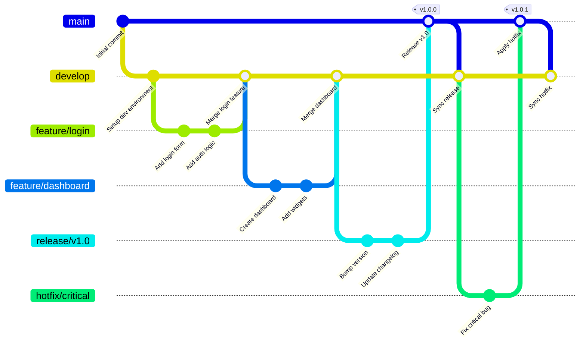
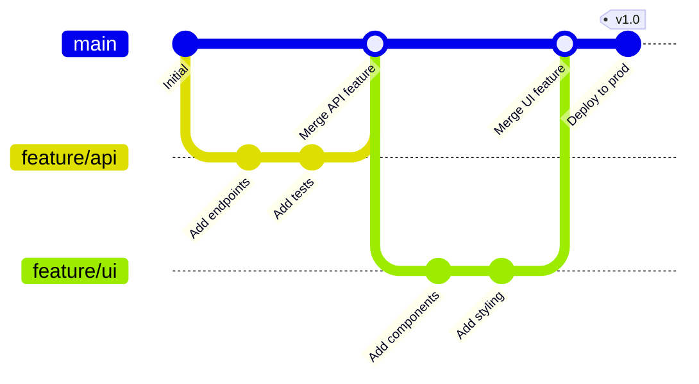
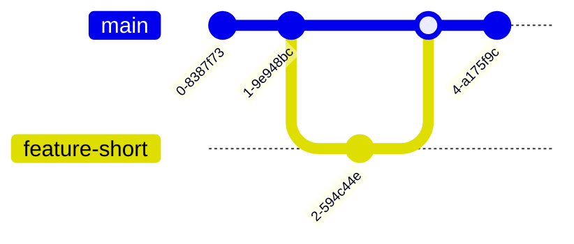
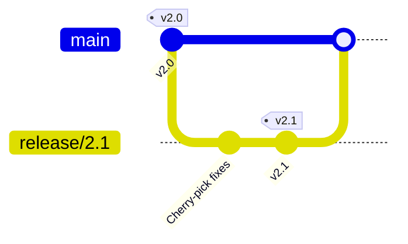

# Git Graphs

Git graphs visualize version control history, including commits, branches, merges, and tags. They're ideal for documenting branching strategies and explaining git workflows.

## Basic Syntax

## Branches

### Creating Branches

### Merging Branches

## Commits

### Basic Commits

### Commits with Tags

### Commits with Types

## Comprehensive Example: GitFlow Workflow

## Feature Branch Workflow

## Best Practices

1. **Use conventional commit messages** - `feat:`, `fix:`, `docs:` prefixes
2. **Tag releases** - Mark version points with `tag: "vX.Y.Z"`
3. **Show merge commits** - Document integration points
4. **Use meaningful branch names** - `feature/`, `bugfix/`, `hotfix/` prefixes
5. **Keep diagrams focused** - Show one workflow per diagram
6. **Highlight important commits** - Use `type: HIGHLIGHT` for critical changes

## Common Branching Strategies

### Trunk-Based Development

### Release Branching

