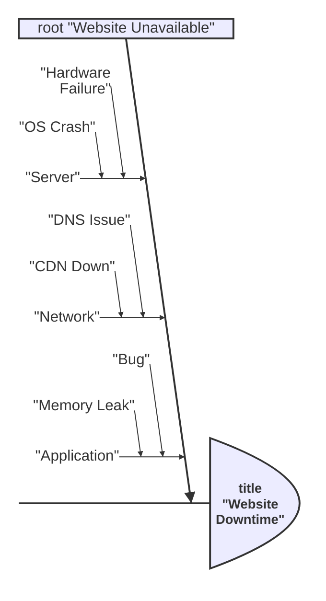
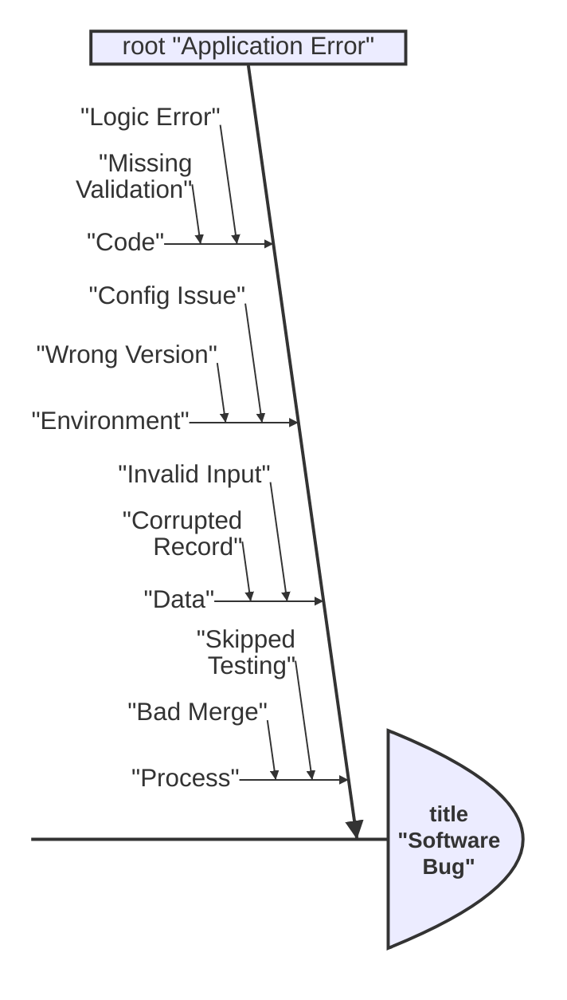
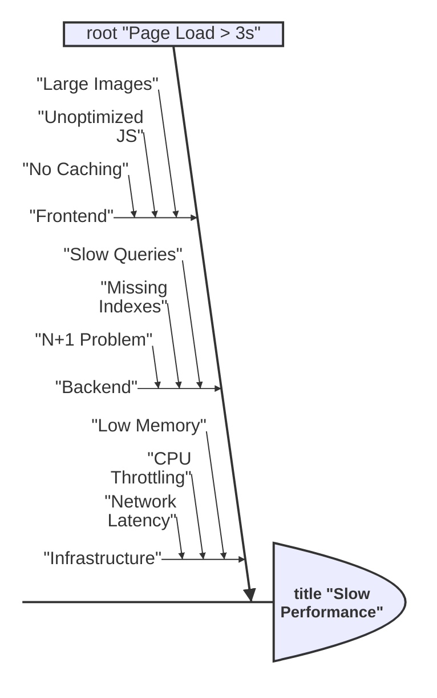
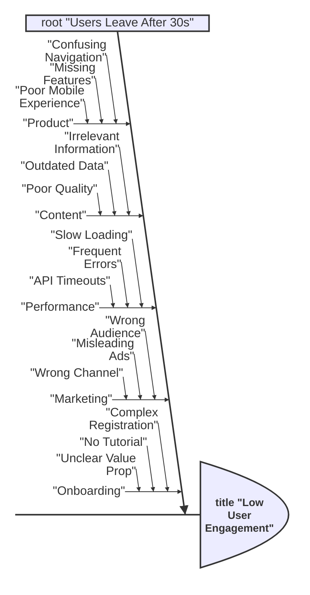

# Ishikawa Diagrams

Ishikawa diagrams (also known as fishbone or cause-and-effect diagrams) are used to represent causes of a specific event or problem, with the main issue at the head and causes branching off the spine.

## Basic Syntax

## Categories and Causes

### Major Categories

Common categories (6 M's):
- Machine (equipment)
- Method (process)
- Material (resources)
- Man (people)
- Measurement (data)
- Milieu/Mother Nature (environment)

## Multiple Sub-causes

Add depth to analysis:

## Comprehensive Example

## Best Practices

1. **Define the problem clearly** - Be specific about the effect
2. **Use major categories** - Group causes logically
3. **Go deep enough** - Ask "why?" 3-5 times for root cause
4. **Involve the team** - Different perspectives find more causes
5. **Prioritize causes** - Focus on the most impactful ones

## Common Use Cases

- Root cause analysis
- Quality improvement
- Problem diagnosis
- Process analysis
- Defect investigation
