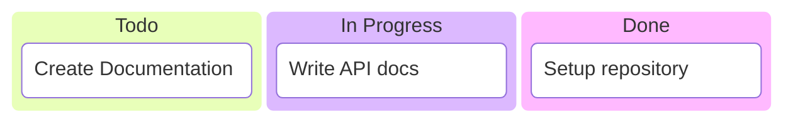
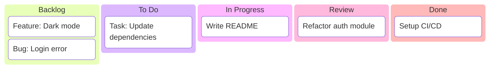
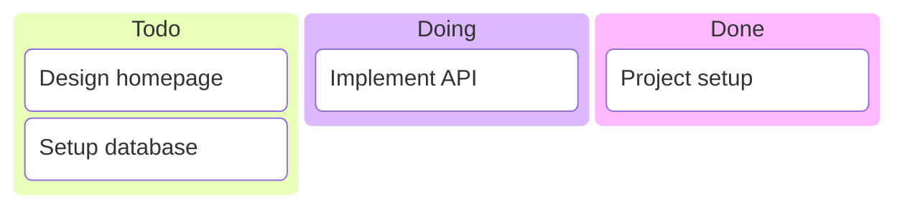

# Kanban Diagrams

Kanban diagrams visualize tasks moving through different stages of a workflow, with columns for each stage and tasks with optional metadata.

## Basic Syntax



## Columns and Tasks

### Defining Columns



### Task IDs

Assign IDs for referencing:



## Task Metadata

### Priority and Assignment

```mermaid
kanban
    Todo
        [High Priority: Fix security bug] :High
        [Medium: Add dark mode] :Medium
        [Low: Update README] :Low
    In Progress
        docs[Write docs] :John
    Done
        [Setup project] :Team
```

## Comprehensive Example: Sprint Board

```mermaid
kanban
    title Sprint 23
    Backlog
        [Feature: Export to PDF]
        [Feature: Email notifications]
        [Bug: Mobile layout issue]
        [Tech Debt: Refactor utils]
    To Do
        [Task: Update API schema]
        docs[Write user guide]
    In Progress
        code[Implement search] :Alice
        test[Add E2E tests] :Bob
    Review
        review[PR #456: Auth fix] :Charlie
        review2[PR #457: UI update] :Diana
    Done
        [Setup staging env]
        [Deploy v2.1.0]
        [Update documentation]
```

## Best Practices

1. **Use clear column names** - Standard: Todo, In Progress, Done
2. **Limit WIP** - Don't overload In Progress column
3. **Add priority labels** - Mark urgent tasks
4. **Assign owners** - Show who is working on what
5. **Keep descriptions short** - Use ticket references for details

## Common Use Cases

- Sprint planning
- Bug tracking
- Feature development
- Content calendars
- Recruitment pipelines
