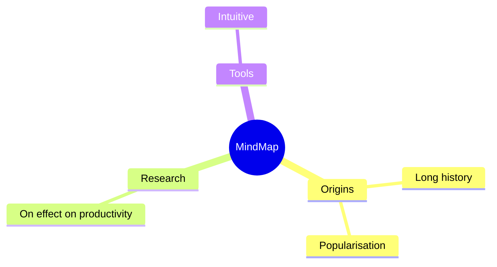
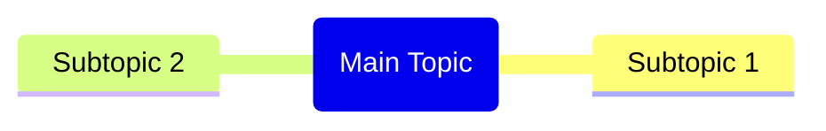
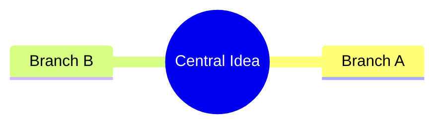
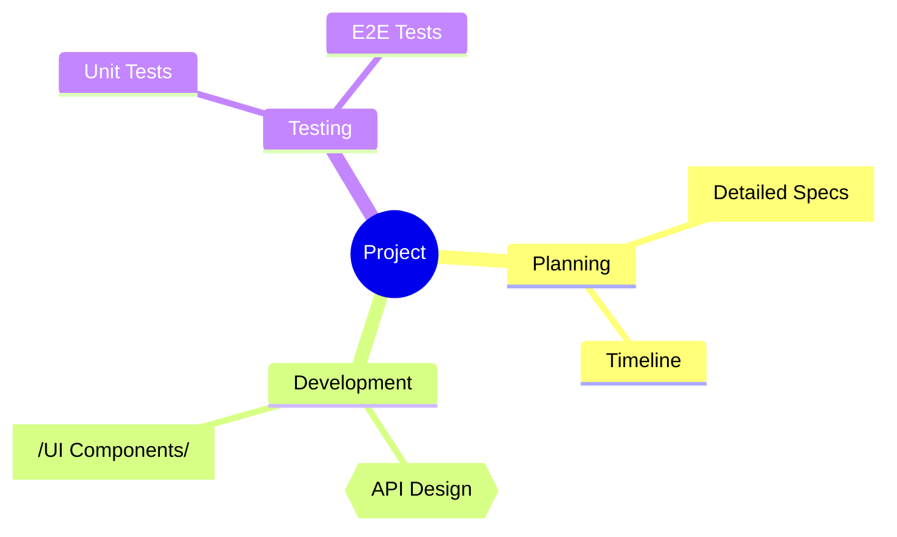
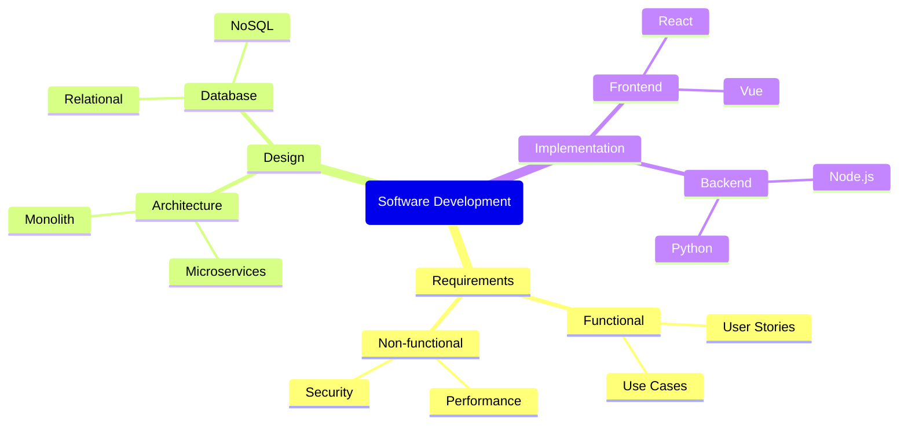
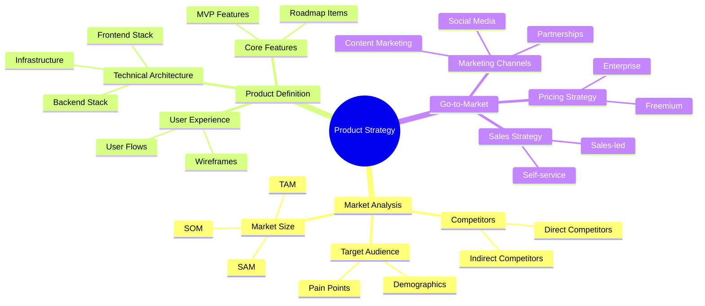

# Mindmaps

Mindmaps visually organize information into a hierarchy, showing relationships among pieces of a whole around a single central concept.

## Basic Syntax

## Root Node

The center of the mindmap can use different shapes:

### Default Root

### Circular Root

## Node Shapes

### Different Node Types

## Hierarchical Levels

Add depth with indentation:

## Comprehensive Example

## Best Practices

1. **Start with a central concept** - Clear, focused root node
2. **Use hierarchical structure** - Group related ideas together
3. **Keep it balanced** - Don't let one branch dominate
4. **Use keywords** - Short phrases work better than long sentences
5. **Add visual variety** - Use different node shapes for different types

## Common Use Cases

- Brainstorming sessions
- Meeting notes
- Project planning
- Knowledge organization
- Concept mapping
