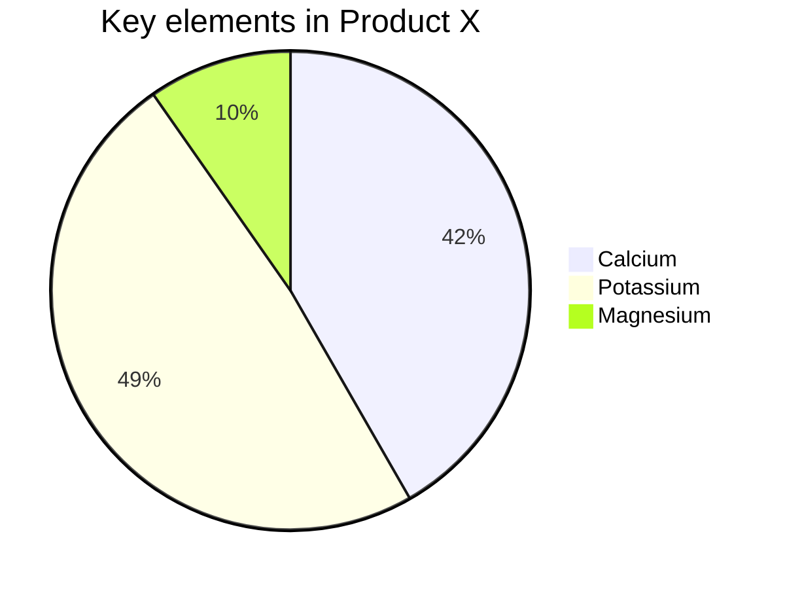
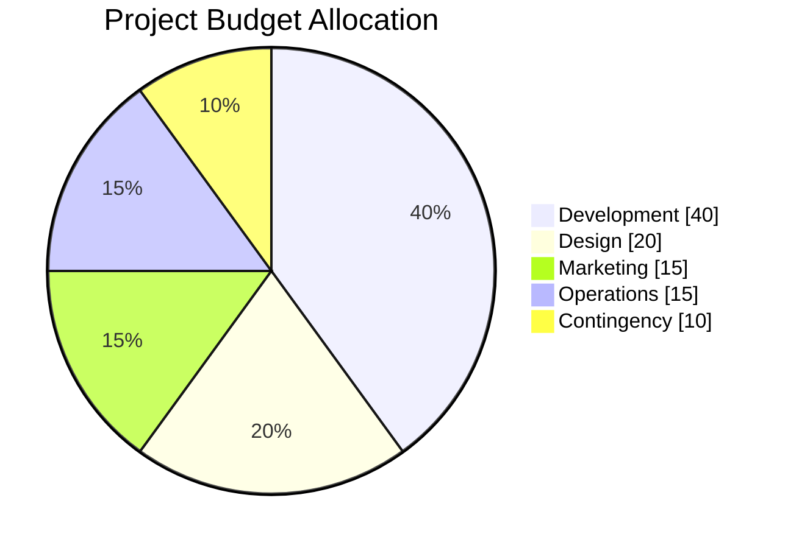
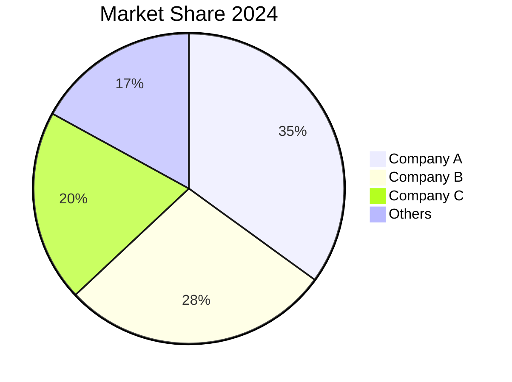
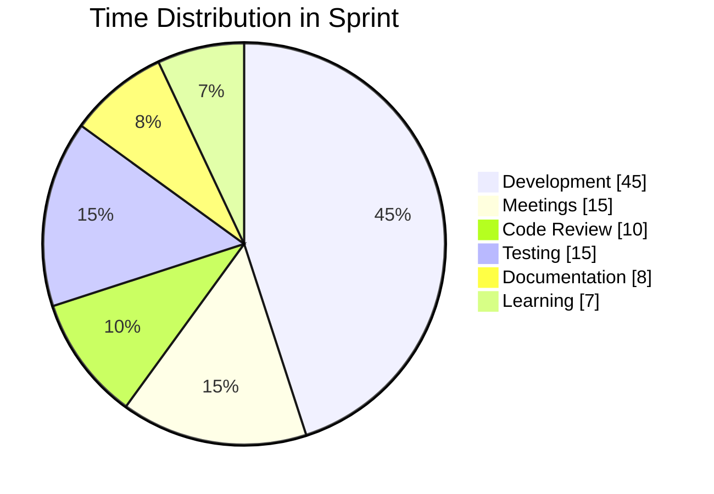

# Pie Charts

Pie charts display data as circular statistical graphics divided into slices, where the arc length of each slice is proportional to the quantity it represents.

## Basic Syntax

## Show Data Values

Display percentages alongside labels:

## Multiple Data Sets

## Comprehensive Example

## Best Practices

1. **Limit slices** - Keep to 5-7 categories for readability
2. **Use percentages or values** - Either works; pick one consistently
3. **Sort by size** - Order slices from largest to smallest
4. **Label clearly** - Use descriptive names with quotes
5. **Use `showData`** - Display values for clarity

## Common Use Cases

- Budget allocation visualization
- Market share analysis
- Time tracking summaries
- Survey result distribution
- Resource utilization
