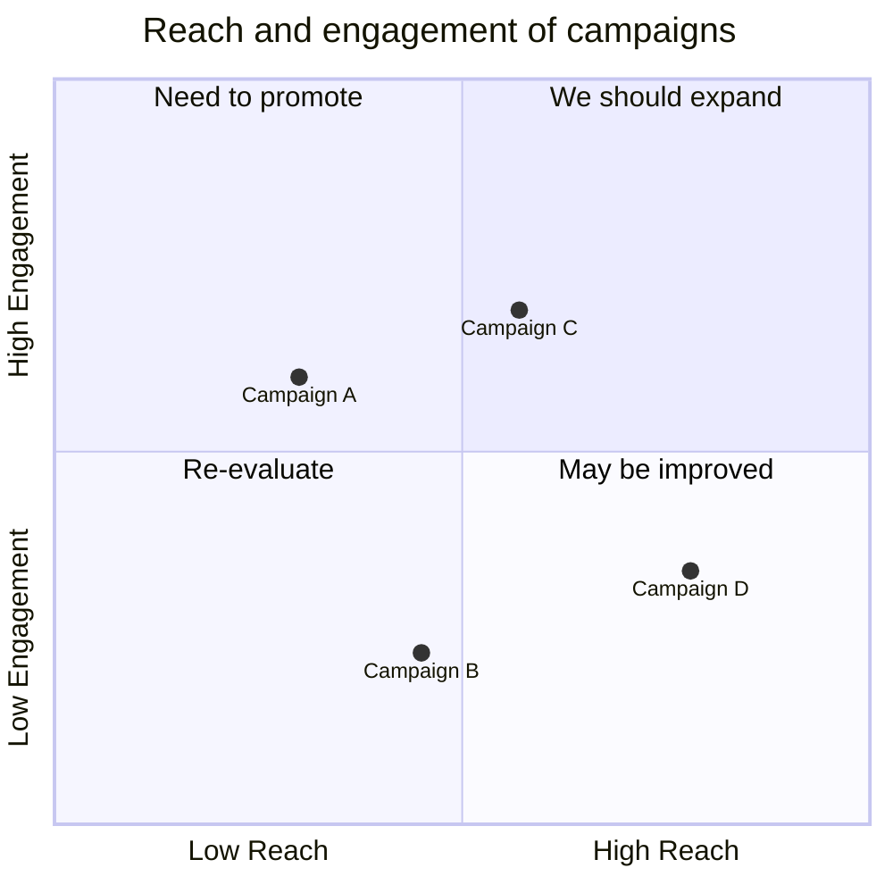
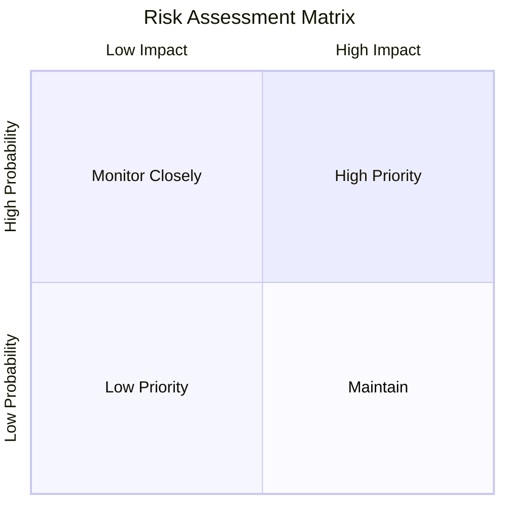
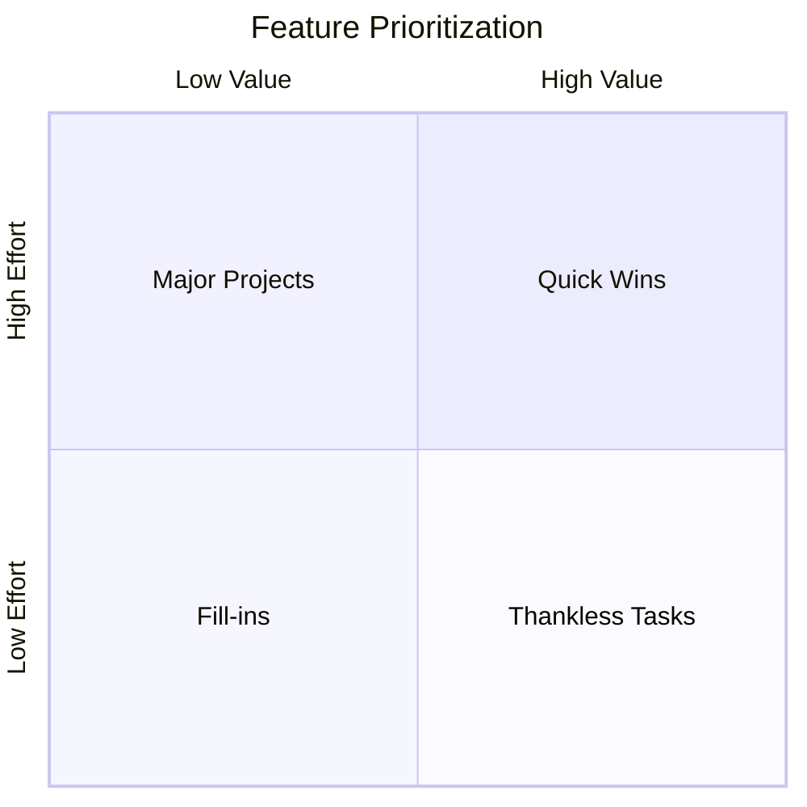
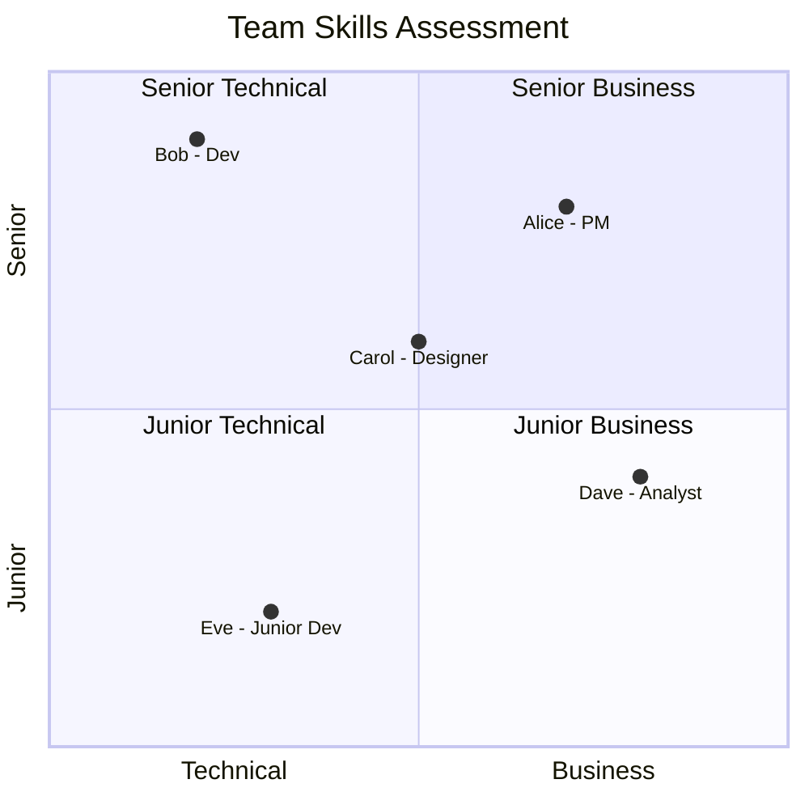

# Quadrant Charts

Quadrant charts divide a two-dimensional grid into four sections, used to plot data points and identify patterns, trends, and priorities.

## Basic Syntax



## Axis Configuration

Define axis labels with ranges:



## Quadrant Labels

Name each of the four quadrants:



## Data Points

Plot items with [x, y] coordinates (0-1 scale):



## Comprehensive Example: Product Portfolio

```mermaid
quadrantChart
    title Product Portfolio Analysis
    x-axis Low Market Growth --> High Market Growth
    y-axis Low Market Share --> High Market Share
    quadrant-1 Stars (Invest)
    quadrant-2 Question Marks (Evaluate)
    quadrant-3 Cash Cows (Maintain)
    quadrant-4 Dogs (Divest)
    
    "Product Alpha" : [0.8, 0.75]
    "Product Beta" : [0.6, 0.85]
    "Product Gamma" : [0.3, 0.2]
    "Product Delta" : [0.85, 0.15]
    "Product Epsilon" : [0.45, 0.55]
    "New Venture" : [0.75, 0.3]
    "Legacy System" : [0.15, 0.8]
```

## Best Practices

1. **Define clear axes** - Axis labels should be opposites (Low/High)
2. **Name quadrants meaningfully** - Each quadrant should suggest an action
3. **Use consistent scale** - Coordinates range from 0 to 1
4. **Limit data points** - Too many items make the chart hard to read
5. **Label points clearly** - Use descriptive names for each point

## Common Use Cases

- Risk assessment matrices
- Feature prioritization
- Skills assessment
- Market positioning
- Strategic planning (BCG matrix)
