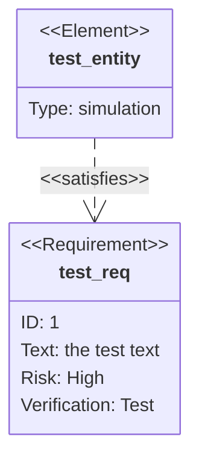
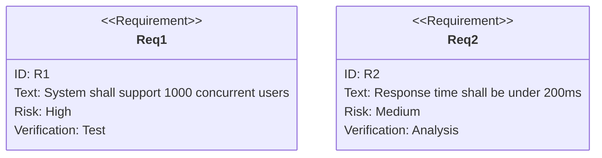

# Requirement Diagrams

Requirement diagrams visualize requirements and their connections to each other and other documented elements, following SysML v1.6 specifications.

## Basic Syntax



## Requirement Types

### Defining Requirements



### Requirement Kinds

Available types: `requirement`, `functionalRequirement`, `interfaceRequirement`, `performanceRequirement`, `physicalRequirement`, `designConstraint`

```mermaid
requirementDiagram
    functionalRequirement FR1 {
        id: FR-001
        text: User can create account via email
    }
    
    performanceRequirement PR1 {
        id: PR-001
        text: Page load time under 3 seconds
    }
    
    designConstraint DC1 {
        id: DC-001
        text: Must comply with GDPR regulations
    }
```

## Elements

### Defining System Elements

```mermaid
requirementDiagram
    element AuthSystem {
        type: Software
    }
    
    element Database {
        type: Hardware
    }
    
    requirement UserAuth {
        id: R-001
        text: System shall authenticate users
    }
    
    AuthSystem - satisfies -> UserAuth
    Database - satisfies -> UserAuth
```

## Relationships

### Link Types

- `contains` - Requirement contains another
- `copies` - Requirement copies another
- `derives` - Requirement is derived from another
- `satisfies` - Element satisfies requirement
- `verifies` - Element verifies requirement
- `refines` - Requirement refines another
- `tracks` - Requirement tracks another

```mermaid
requirementDiagram
    requirement ParentReq {
        id: R-001
        text: System shall be secure
    }
    
    requirement ChildReq {
        id: R-001.1
        text: All passwords must be hashed
    }
    
    element PasswordService {
        type: Software
    }
    
    ParentReq - contains -> ChildReq
    PasswordService - satisfies -> ChildReq
```

## Comprehensive Example

```mermaid
requirementDiagram
    requirement UserManagement {
        id: R-001
        text: System shall manage user accounts
        risk: high
        verifymethod: test
    }
    
    functionalRequirement UserRegistration {
        id: R-001.1
        text: User shall register with email and password
        risk: medium
        verifymethod: test
    }
    
    functionalRequirement UserLogin {
        id: R-001.2
        text: User shall login with credentials
        risk: high
        verifymethod: test
    }
    
    performanceRequirement ResponseTime {
        id: R-002
        text: Login response under 500ms
        risk: medium
        verifymethod: analysis
    }
    
    designConstraint Security {
        id: R-003
        text: Must use OAuth 2.0 for authentication
        risk: high
        verifymethod: inspection
    }
    
    element AuthService {
        type: Software
    }
    
    element UserDB {
        type: Database
    }
    
    UserManagement - contains -> UserRegistration
    UserManagement - contains -> UserLogin
    UserLogin - derives -> ResponseTime
    AuthService - satisfies -> UserRegistration
    AuthService - satisfies -> UserLogin
    AuthService - satisfies -> Security
    UserDB - satisfies -> UserRegistration
    UserDB - satisfies -> UserLogin
```

## Best Practices

1. **Use unique IDs** - Requirements should have traceable identifiers
2. **Assess risk** - Mark each requirement with risk level
3. **Define verify method** - Specify how to verify (test, analysis, inspection)
4. **Link elements** - Show which system components satisfy requirements
5. **Hierarchical structure** - Use contains/derives for requirement decomposition

## Common Use Cases

- System requirements specification
- Compliance tracking
- Validation and verification planning
- Requirements traceability matrices
- Design verification
