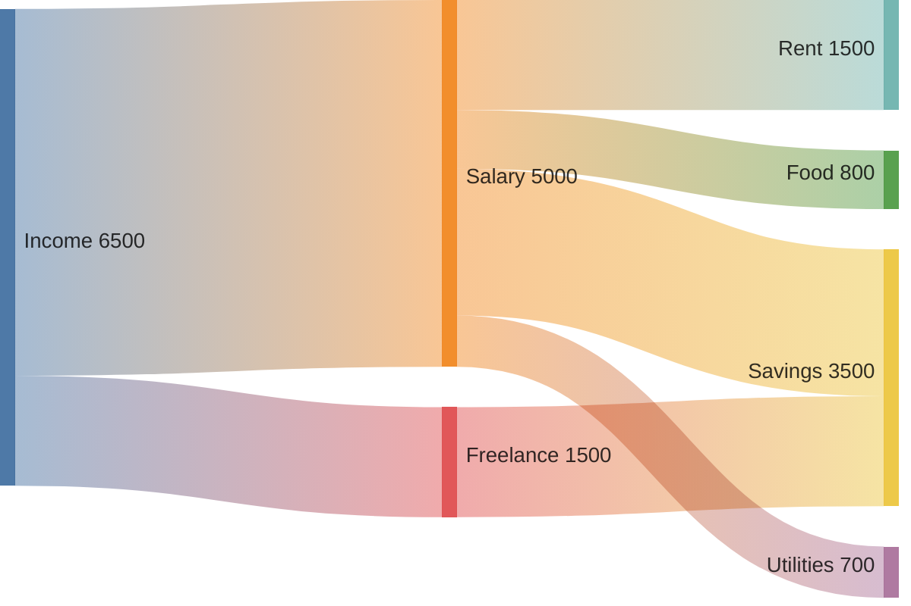
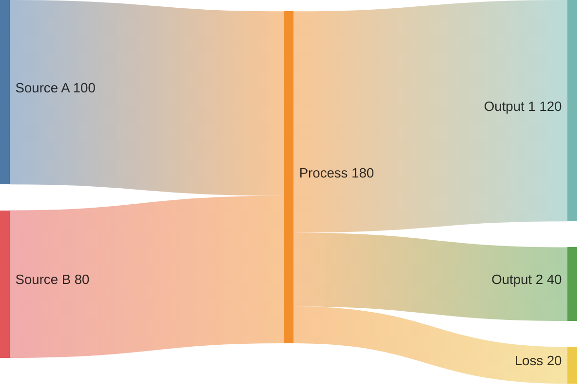
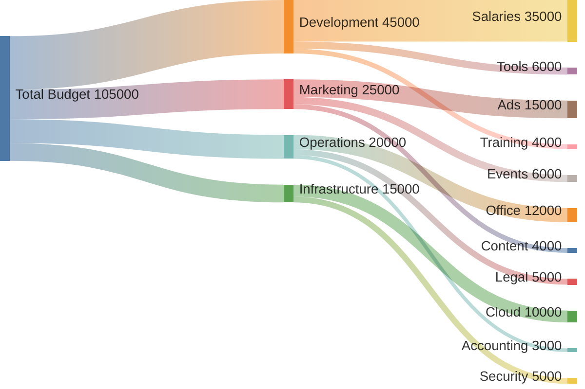
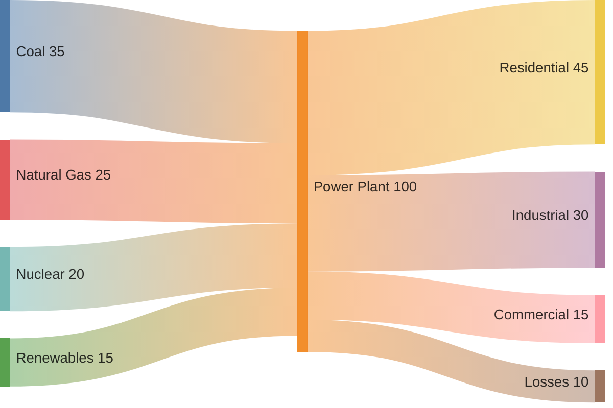

# Sankey Diagrams

Sankey diagrams visualize flows from one set of values to another, where the width of each link is proportional to the flow value. They're ideal for showing energy, material, or budget flows.

## Basic Syntax

```mermaid
sankey-beta
    Agricultural "waste",Bio-conversion,124.729
    Bio-conversion,Liquid,0.597
    Bio-conversion,Losses,26.862
```

## Nodes and Flows

Each line defines a flow: `Source,Target,Value`



## Multiple Sources and Targets

Nodes can have multiple incoming and outgoing flows:



## Comprehensive Example: Budget Flow



## Energy Flow Example



## Best Practices

1. **Consistent units** - All values should use the same unit
2. **Balance the diagram** - Total inputs should equal total outputs
3. **Use descriptive node names** - Clear labels help understanding
4. **Order logically** - Flow left-to-right or top-to-bottom
5. **Limit complexity** - Too many nodes make diagrams hard to read

## Common Use Cases

- Budget allocation flows
- Energy consumption analysis
- Material flow analysis
- User journey funnels
- Supply chain visualization
