# State Diagrams

State diagrams model the behavior of systems with a finite number of states, showing how an object transitions from one state to another in response to events.

## Basic Syntax

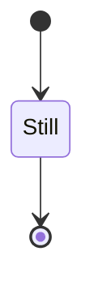

## States and Transitions

### Simple States

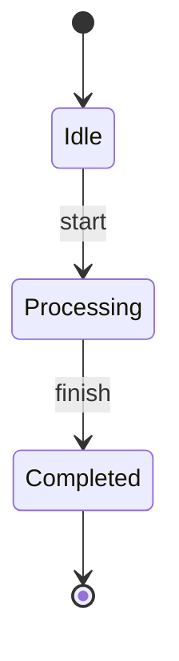

### State with Description

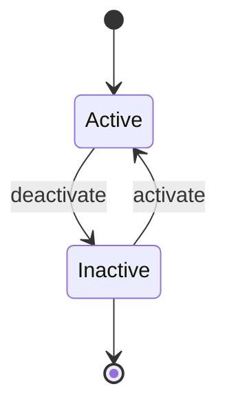

## Composite States

Group related states together:

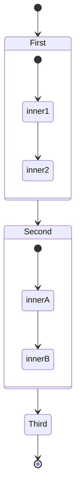

## Forks and Joins

Split into parallel states or join them back:

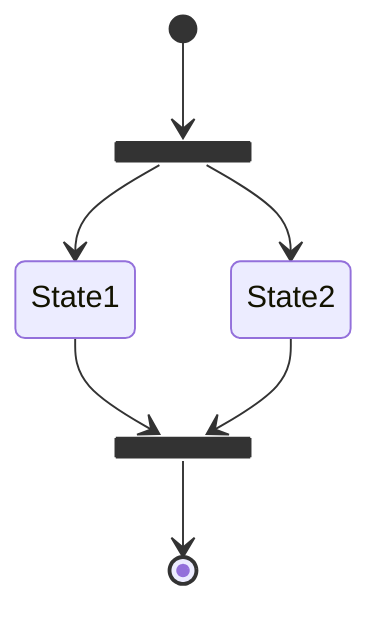

## Notes

Add explanatory notes to states:

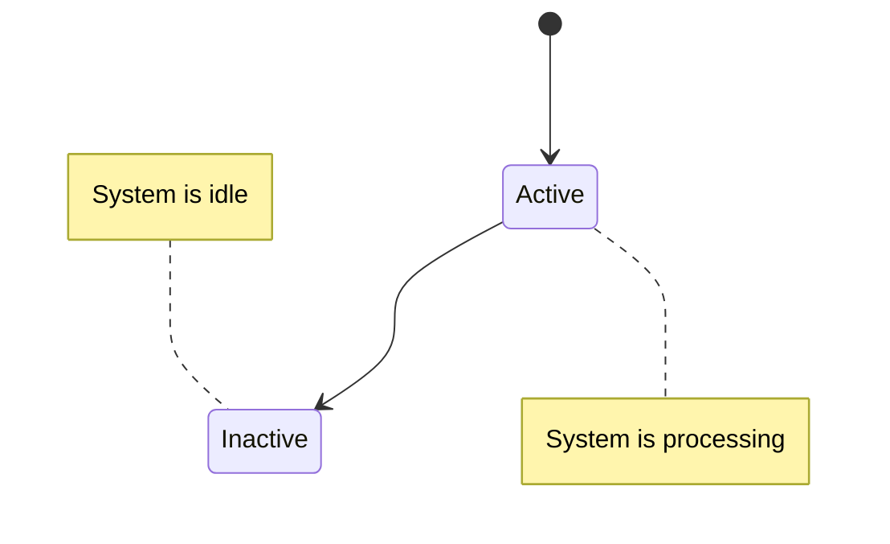

## Choice (Conditional)

Diamond-shaped decision points:

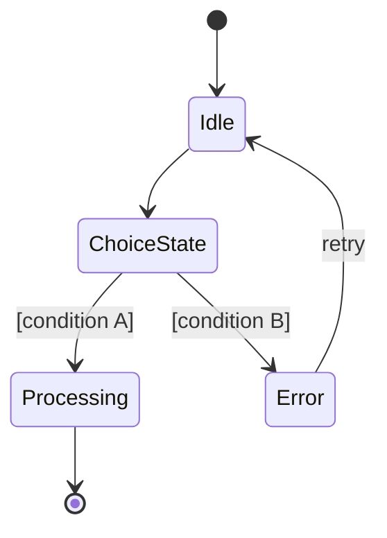

## Comprehensive Example: Order Lifecycle

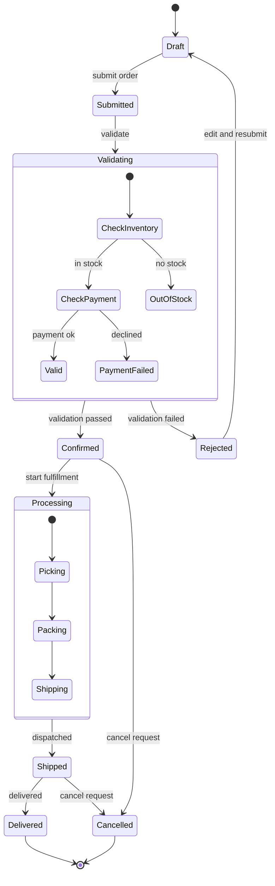

## Best Practices

1. **Use descriptive state names** - Clear names make diagrams self-documenting
2. **Show all transitions** - Document how the system moves between states
3. **Include start and end states** - Use `[*]` for initial and final states
4. **Group related states** - Use composite states for complex hierarchies
5. **Label transitions** - Event names on arrows clarify what triggers changes
6. **Handle errors** - Include error states and recovery paths

## Common Patterns

### Simple Toggle
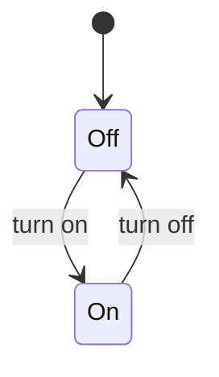

### Three-State System
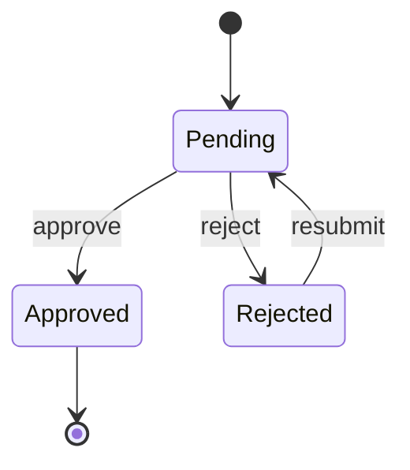

### Loop with Exit
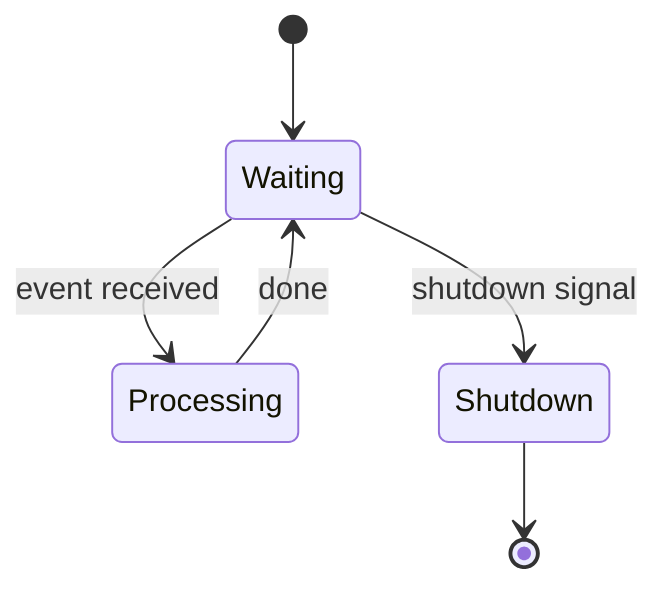
