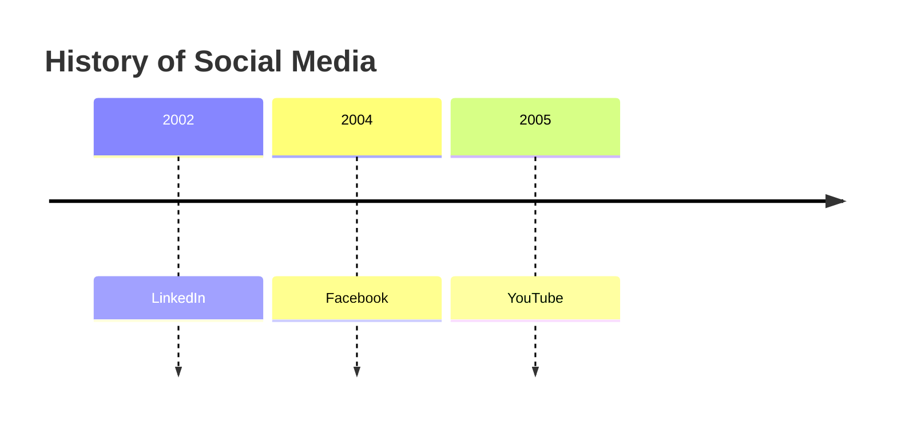
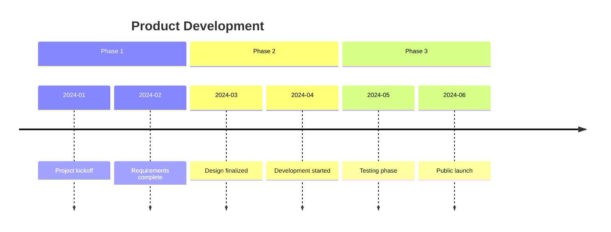
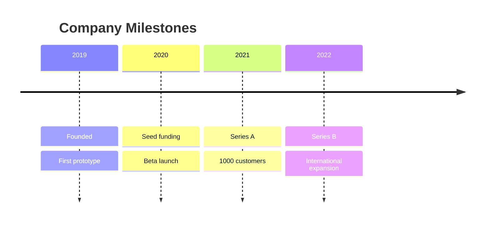
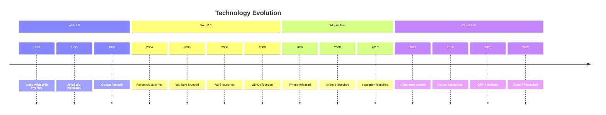

# Timelines

Timelines illustrate chronological sequences of events, dates, or periods, organized with optional sections for grouping related events.

## Basic Syntax

## Sections

Group events into logical periods:

## Multiple Events per Period

Show multiple events at the same time:

## Comprehensive Example

## Best Practices

1. **Use consistent date format** - Choose one format and stick to it
2. **Group with sections** - Organize related events together
3. **Keep descriptions concise** - Short phrases work best
4. **Show parallel events** - Use multiple entries per time period
5. **Include significance** - Highlight why events matter

## Common Use Cases

- Project roadmaps
- Product evolution
- Company history
- Historical events
- Release schedules
