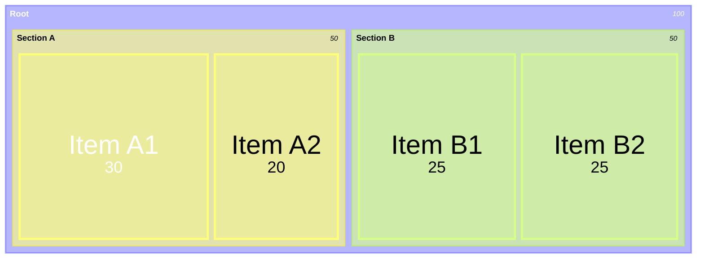
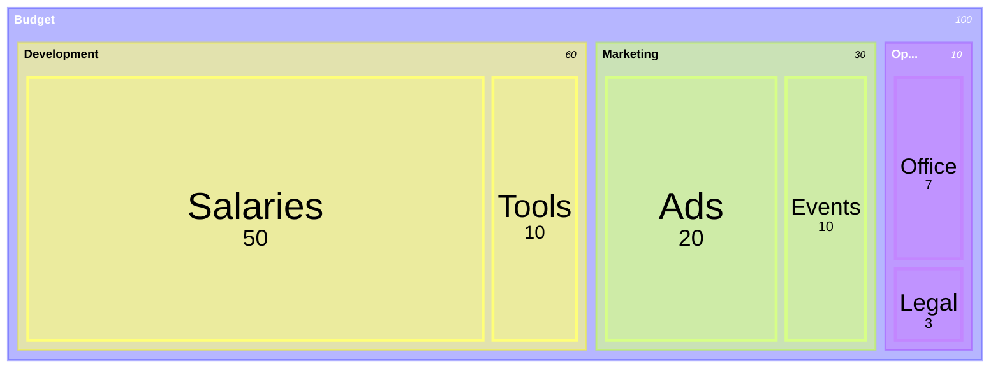
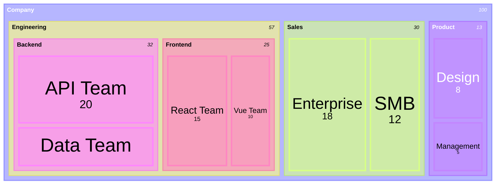
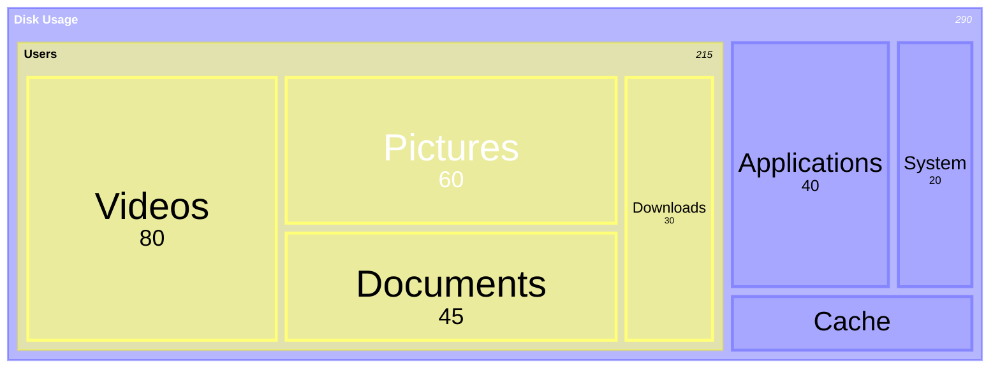
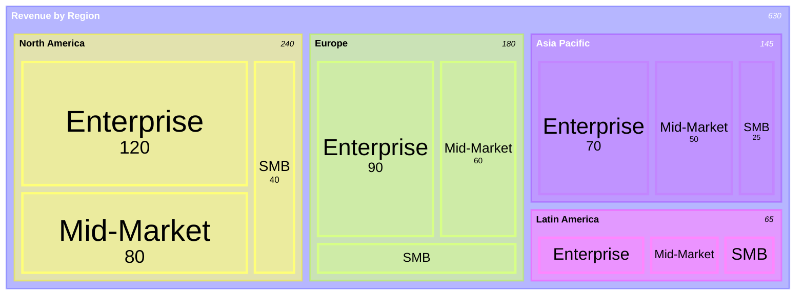

# Treemaps

Treemaps display hierarchical data as a set of nested rectangles, where the area of each rectangle is proportional to the value it represents.

## Basic Syntax

## Hierarchical Data

### Simple Hierarchy

### Deep Nesting

## Value Assignment

Use `: value` to assign numeric values:

## Comprehensive Example

## Best Practices

1. **Use meaningful names** - Labels should clearly identify each item
2. **Ensure values are positive** - Treemaps require positive numeric values
3. **Balance hierarchy depth** - Too deep makes visualization complex
4. **Group logically** - Organize related items under common parents
5. **Use consistent units** - All values should use the same scale

## Common Use Cases

- Disk space usage
- Budget allocation breakdown
- Market share by category
- Portfolio composition
- Website traffic by section
