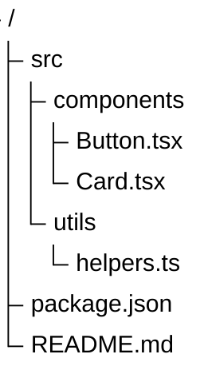
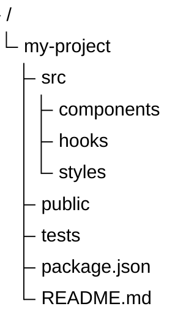
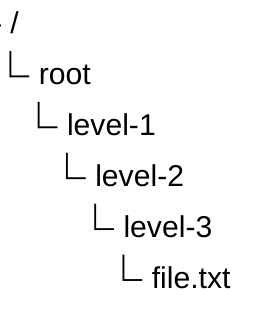
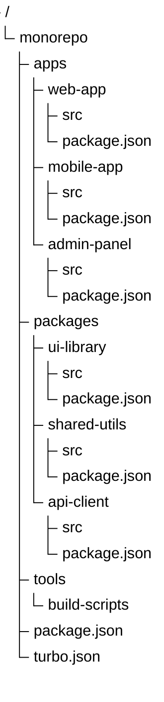
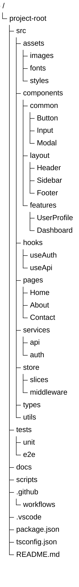

# TreeViews

TreeViews represent hierarchical data in the form of a directory-like structure, using indentation to indicate nesting levels. They're ideal for file systems, org charts, and nested categories.

## Basic Syntax

## Directory Structure

### Simple Project

### Deep Nesting

## File Organization

### Monorepo Structure

## Comprehensive Example

## Best Practices

1. **Use clear names** - Files and folders should be self-documenting
2. **Group logically** - Organize by function or feature
3. **Limit depth** - Too many levels make navigation hard
4. **Use consistent structure** - Follow project conventions
5. **Show key files** - Include important configuration files

## Common Use Cases

- Project file structure
- Directory organization
- Package hierarchies
- Org charts (with adaptation)
- Category trees
