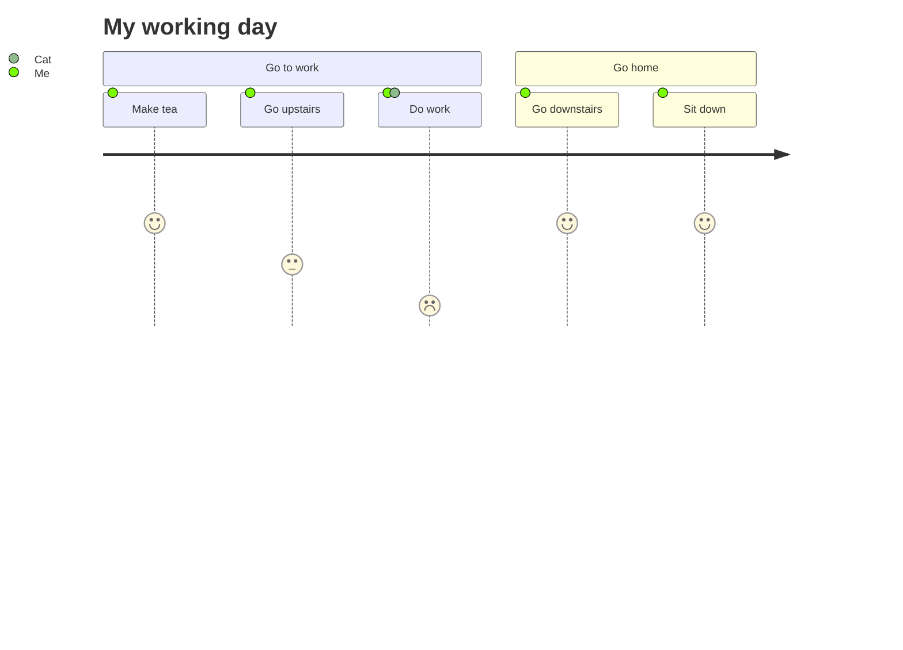
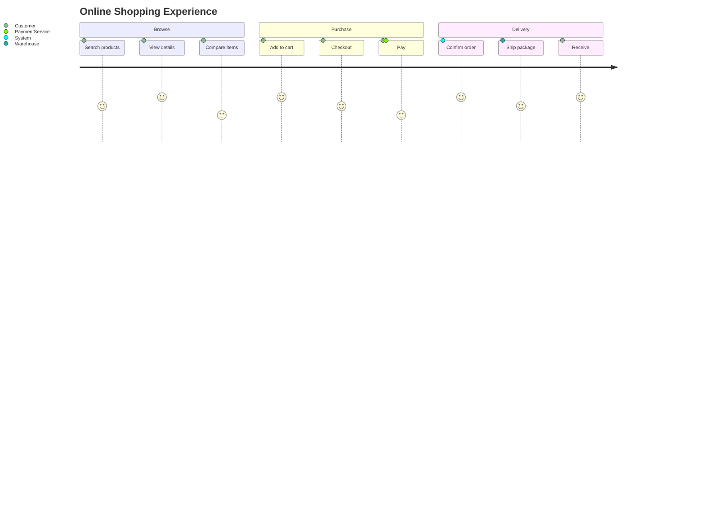
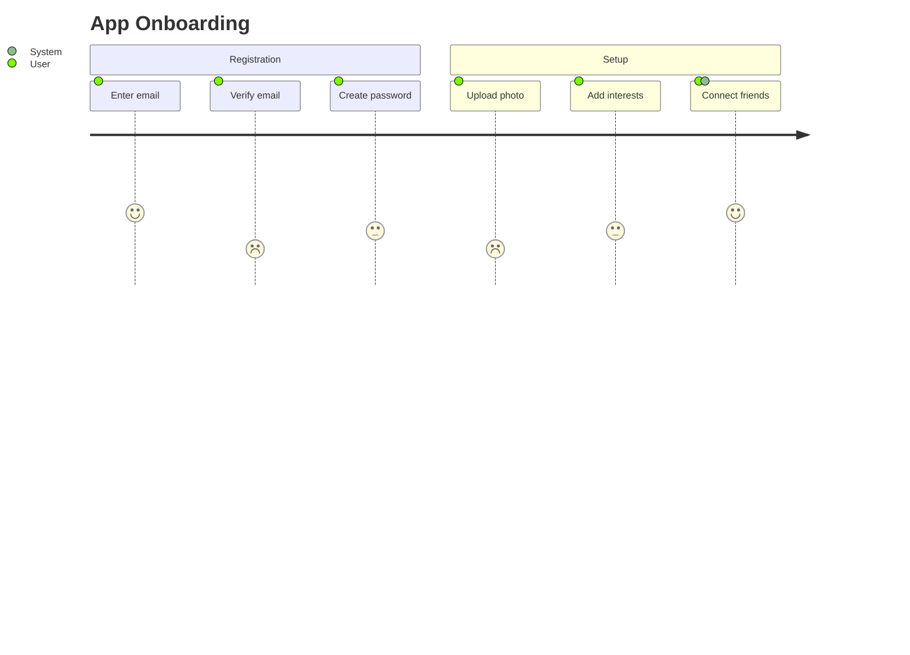
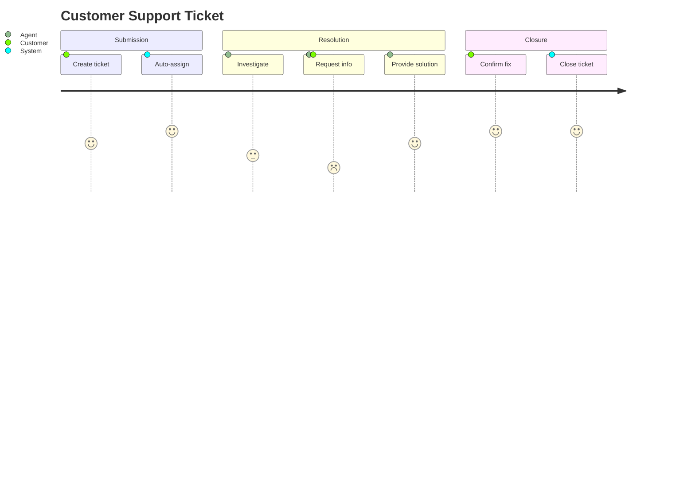
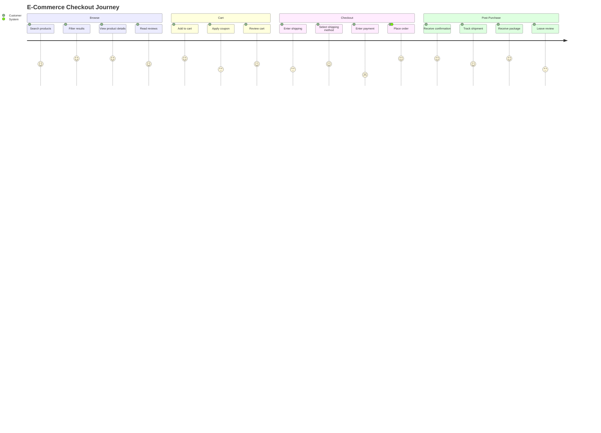

# User Journey Diagrams

User journey diagrams describe the exact steps different users take to complete a specific task within a system. Tasks are scored by satisfaction (1-5) and assigned to actors.

## Basic Syntax

## Sections and Tasks

### Defining Sections

Break journeys into logical sections:

### Task Scoring

Score each task from 1-5 (5 = highest satisfaction):

## Multiple Actors

Show when multiple actors are involved:

## Comprehensive Example: E-Commerce Checkout

## Best Practices

1. **Use clear section names** - Break journeys into logical phases
2. **Be honest with scores** - Low scores identify pain points
3. **Include all actors** - Show when systems or other users are involved
4. **Focus on one persona** - Create separate diagrams for different user types
5. **Iterate and improve** - Re-score after UX improvements

## Common Use Cases

- UX research and analysis
- Customer experience mapping
- Service design
- Process improvement
- Onboarding flow evaluation
