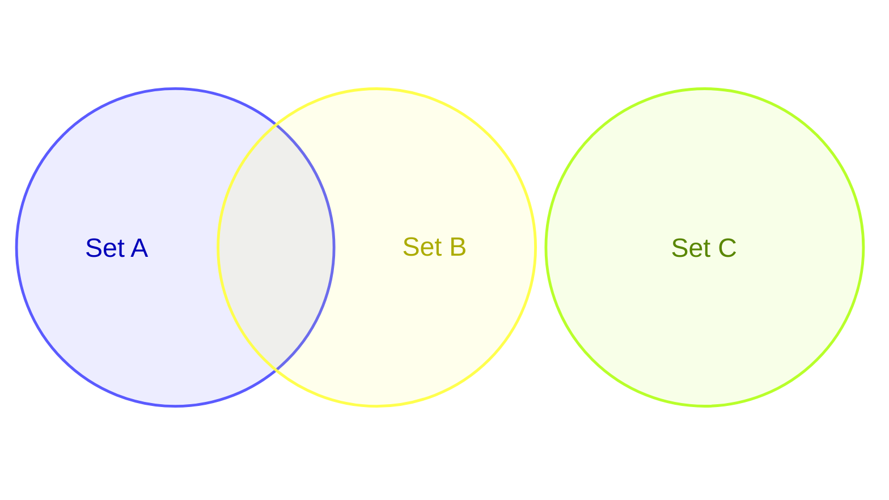
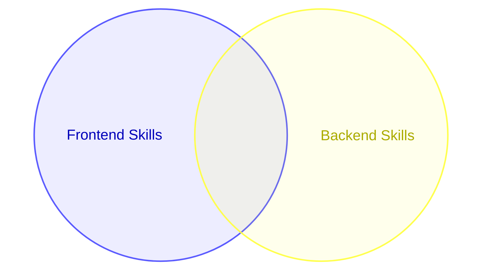
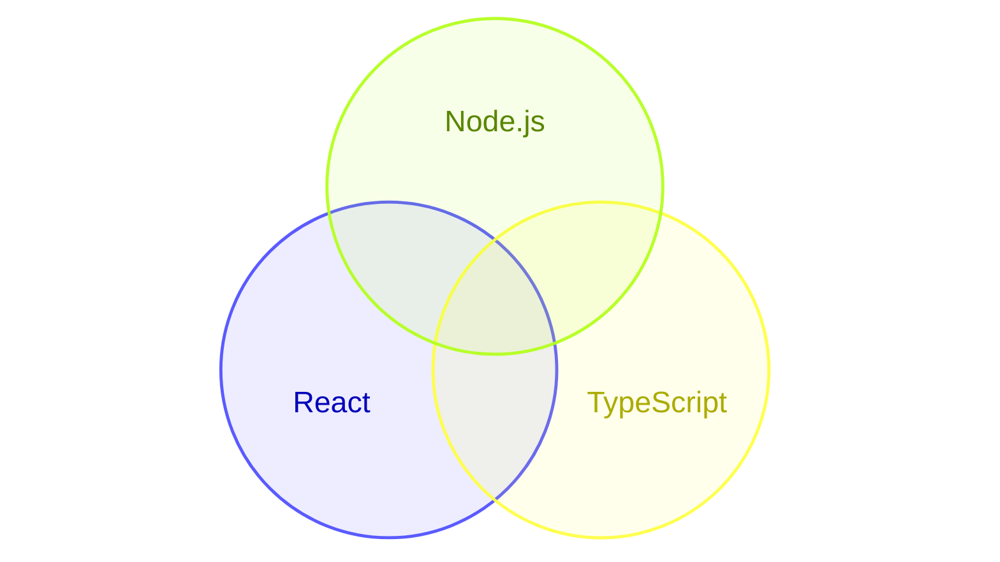

# Venn Diagrams

Venn diagrams show relationships between sets using overlapping circles, supporting set definitions, unions, labels, sizes, and text nodes.

## Basic Syntax



## Set Definitions

### Two Sets



### Three Sets



## Custom Labels

```mermaid
venn-beta
    set Mobile["Mobile Developers"]
    set Web["Web Developers"]
    set FullStack["Full Stack"] {
        Mobile & Web
    }
    union Mobile, Web
```

## Comprehensive Example

```mermaid
venn-beta
    set Design["UX Design"]
    set Research["User Research"]
    set Code["Frontend Dev"]
    
    union Design, Research
    union Design, Code
    union Research, Code
    union Design, Research, Code {
        "Product Designer"
    }
```

## Best Practices

1. **Use descriptive labels** - Name sets clearly
2. **Limit to 3 sets** - More than 3 becomes hard to interpret
3. **Show intersections** - Use unions to highlight overlaps
4. **Label intersections** - Add text to explain what overlaps mean
5. **Keep it simple** - Focus on key relationships

## Common Use Cases

- Feature comparison
- Audience segmentation
- Skill set analysis
- Capability overlap
- Market analysis
