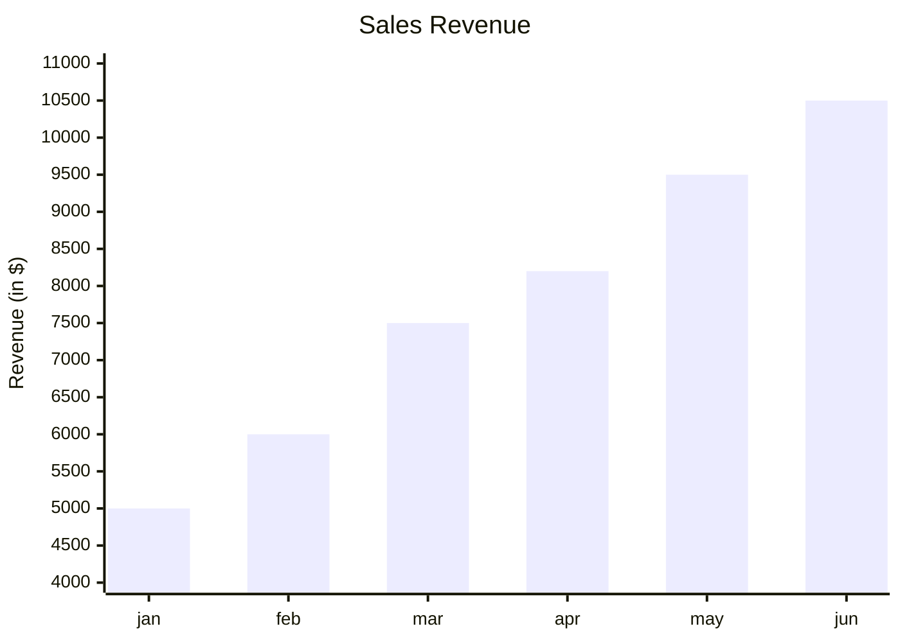
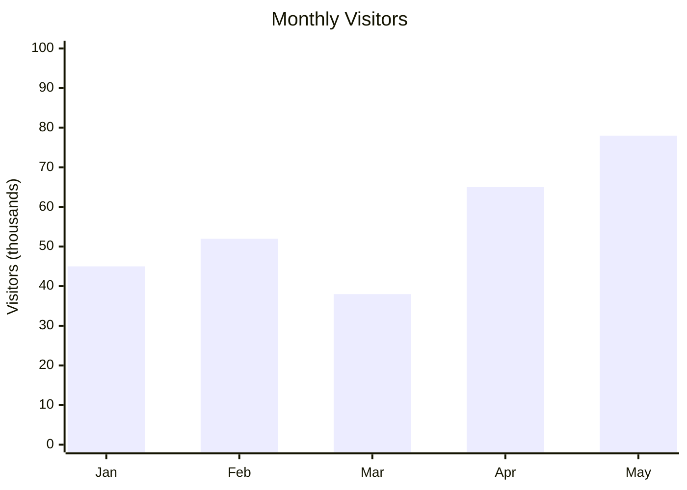
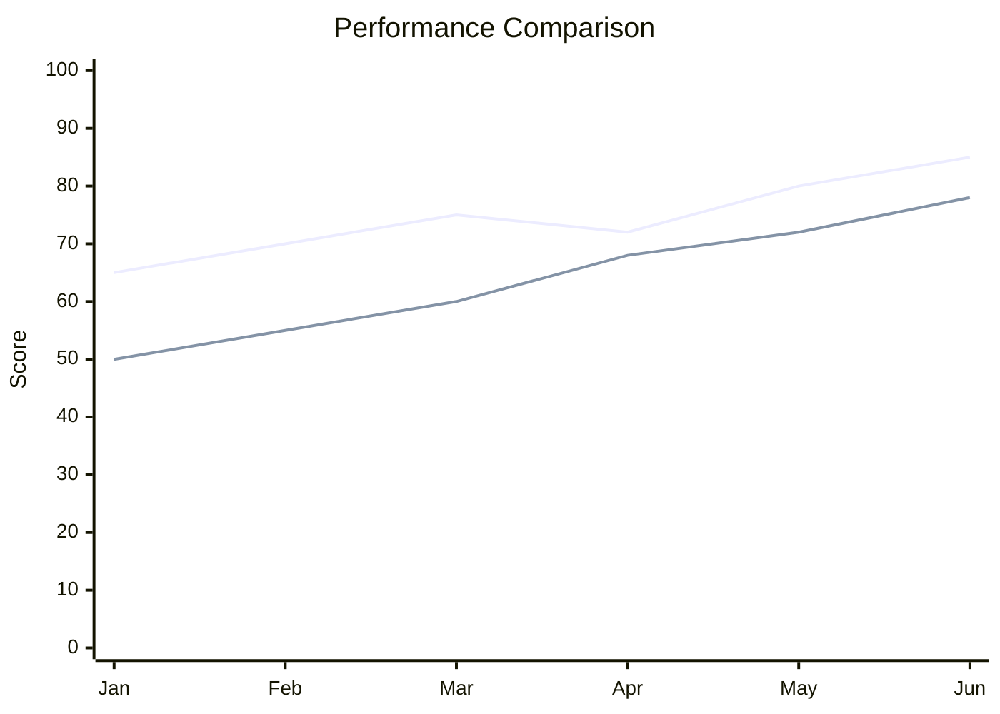
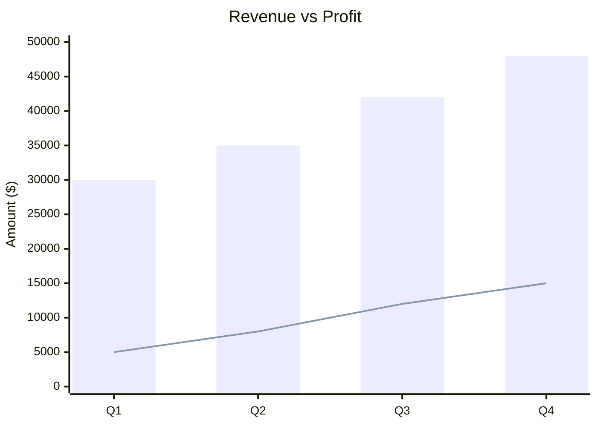
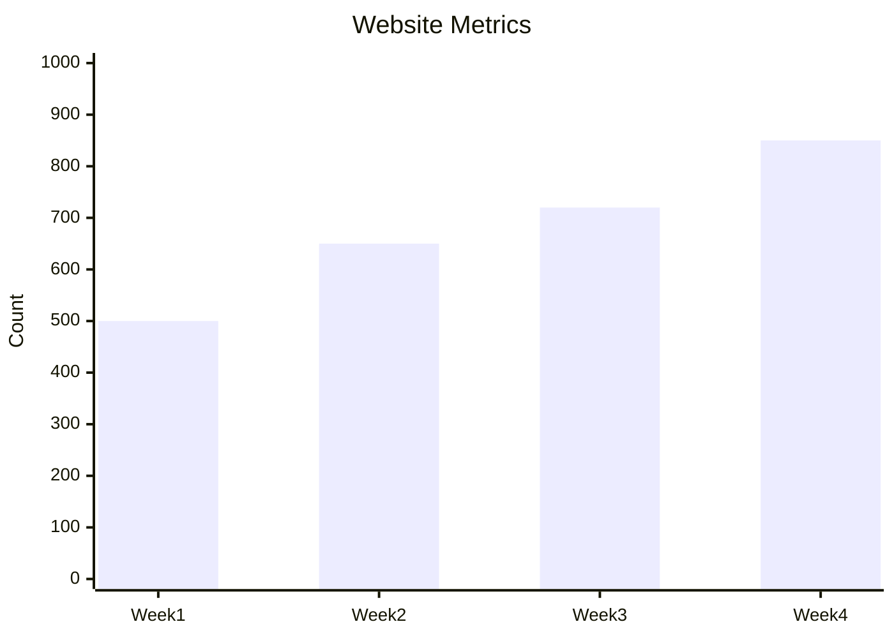
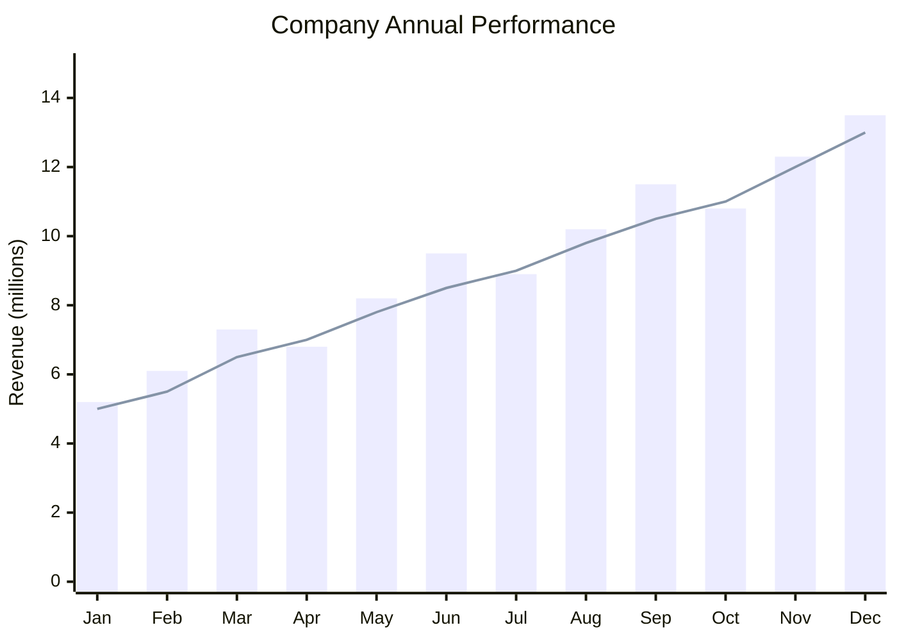

# XY Charts

XY charts provide comprehensive charting capabilities including bar charts and line charts using both x-axis and y-axis for data representation.

## Basic Syntax



## Bar Charts

### Simple Bar Chart



### Multiple Bar Series

```mermaid
xychart-beta
    title "Product Sales Comparison"
    x-axis [Q1, Q2, Q3, Q4]
    y-axis "Sales (units)" 0 --> 500
    bar [200, 250, 300, 450]
    bar [150, 180, 220, 280]
```



## Line Charts

### Simple Line Chart

```mermaid
xychart-beta
    title "Temperature Trends"
    x-axis [Mon, Tue, Wed, Thu, Fri]
    y-axis "Temperature (°C)" 0 --> 40
    line [22, 25, 28, 24, 26]
```

### Multiple Line Series



## Combined Bar and Line



## Axis Configuration

### Custom X-Axis Labels



### Y-Axis Range

```mermaid
xychart-beta
    title "Stock Price"
    x-axis [Mon, Tue, Wed, Thu, Fri]
    y-axis "Price ($)" 100 --> 200
    line [120, 135, 128, 150, 165]
```

## Comprehensive Example: Annual Report



## Best Practices

1. **Choose the right chart type** - Bars for discrete comparisons, lines for trends
2. **Label axes clearly** - Include units and descriptive names
3. **Set appropriate ranges** - Y-axis should fit data with some padding
4. **Limit series** - Too many lines/bars become hard to read
5. **Use consistent colors** - Match colors in legends to data

## Common Use Cases

- Financial reporting
- Performance metrics
- Sales tracking
- Website analytics
- Scientific data visualization
