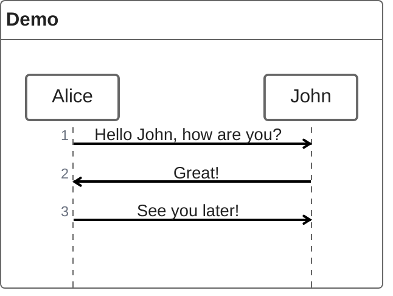
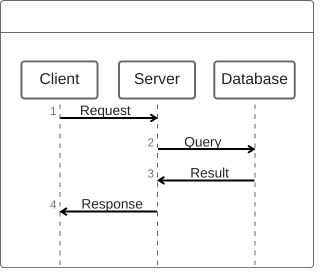
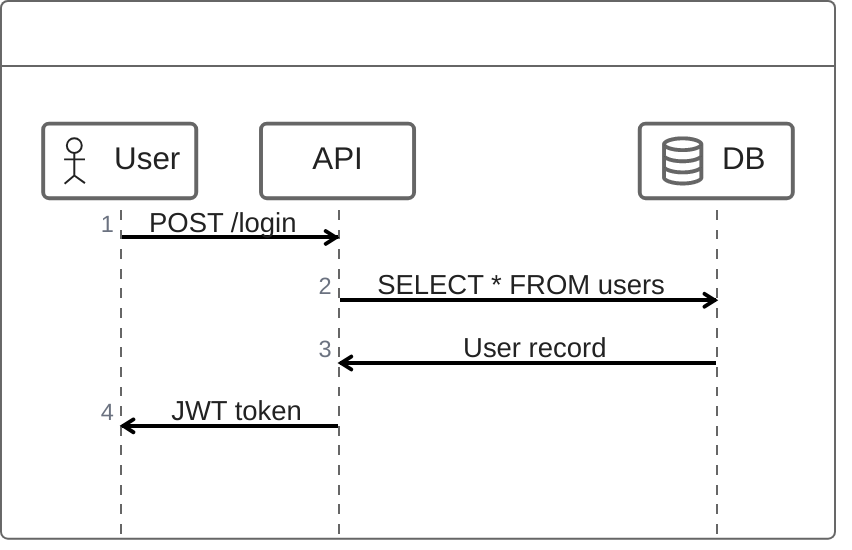
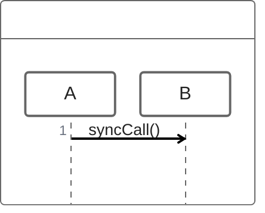
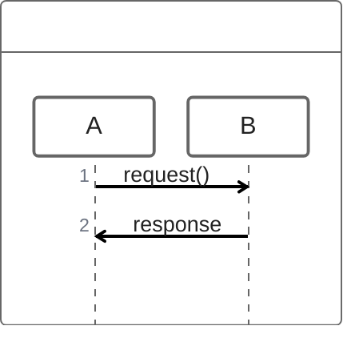
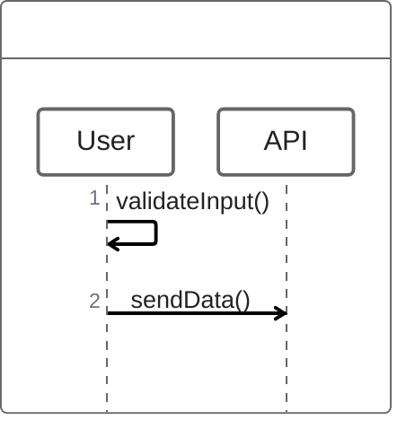
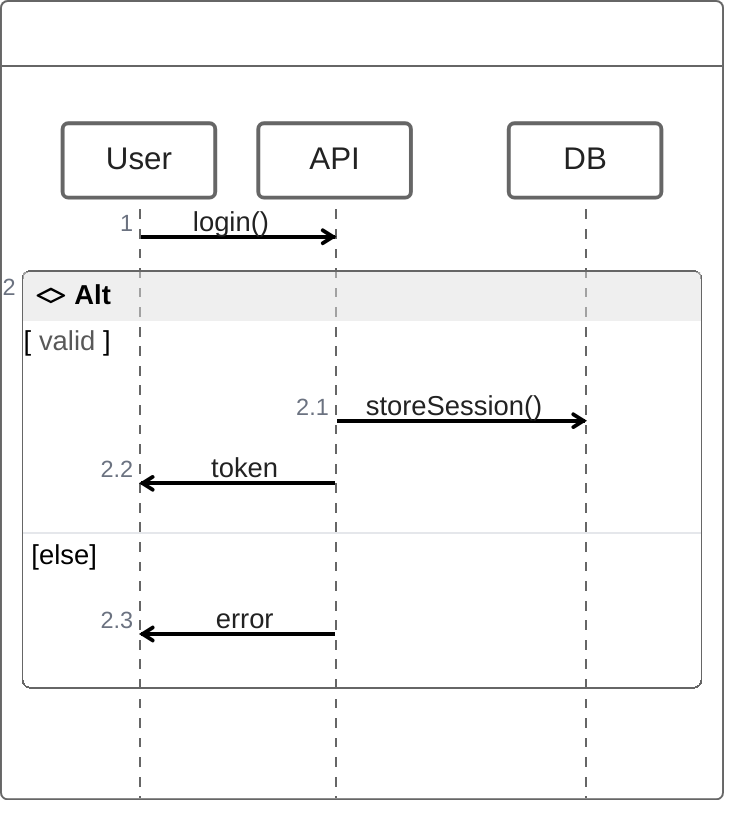
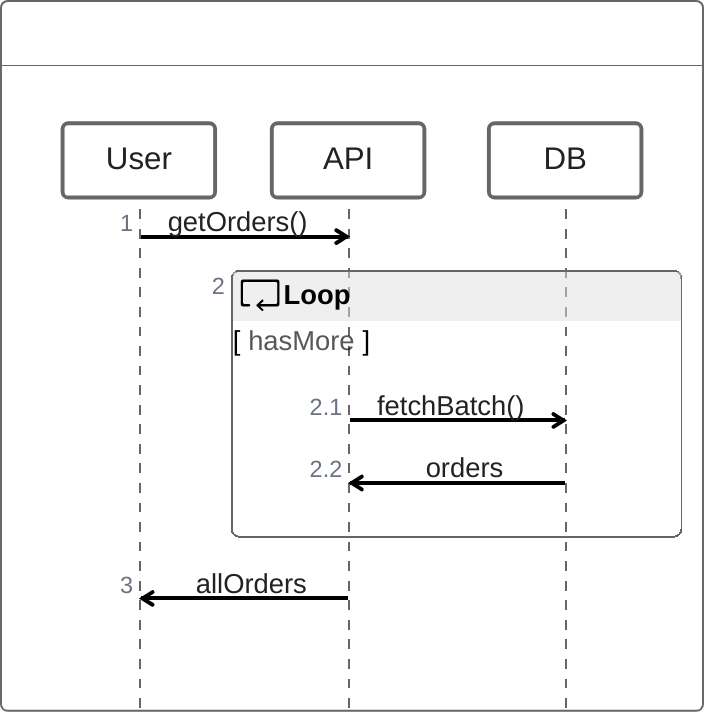
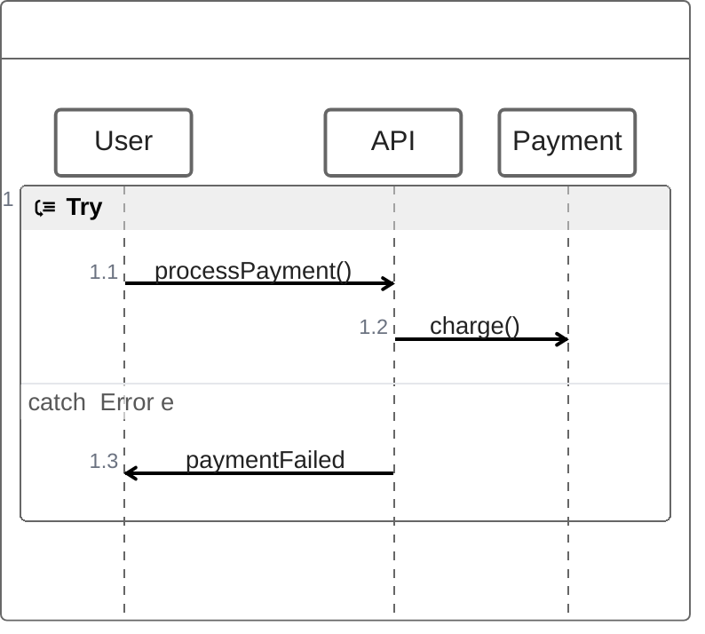
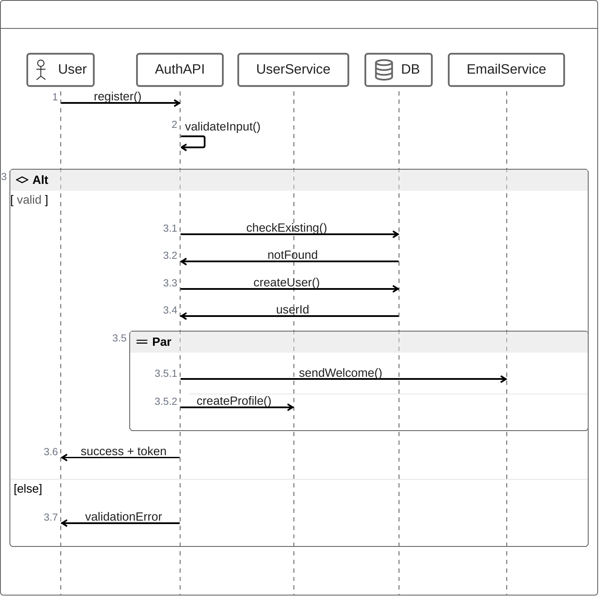

# ZenUML Diagrams

ZenUML provides an alternative syntax for sequence diagrams, using a code-like bracket-based format similar to programming languages. It's ideal for developers who prefer inline function call syntax.

## Basic Syntax

## Participants

### Simple Participants

### Named Participants

## Messages

### Synchronous Calls

### Replies

### Self Calls

## Grouping

### IF/ELSE

### Loops

### Try/Catch

## Comprehensive Example

## Best Practices

1. **Use @declarations** - Type participants with @Actor, @Service, @Database
2. **Group with brackets** - Use if/while/try for complex logic
3. **Keep it readable** - Prefer ZenUML when you want code-like syntax
4. **Use par for parallel** - Show concurrent operations
5. **Self calls for internals** - Show internal processing

## When to Use ZenUML vs Sequence Diagram

**Use ZenUML when:**
- You prefer coding syntax
- Working with developers familiar with code blocks
- Need inline conditionals/loops
- Want a more compact representation

**Use standard sequenceDiagram when:**
- Working with non-developers
- Need visual richness (notes, activations, etc.)
- Need more diagram types (break, critical regions)
